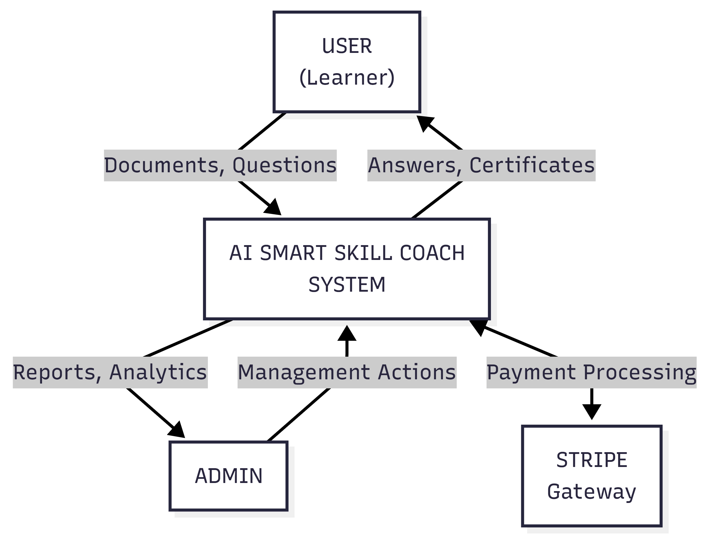
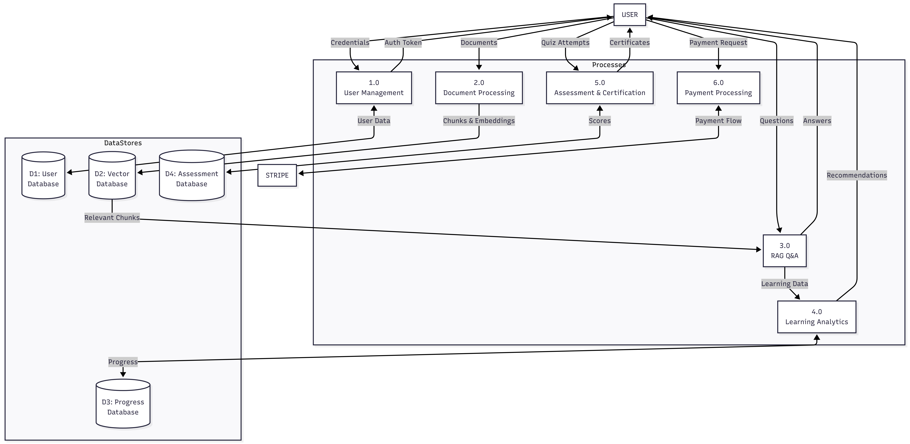
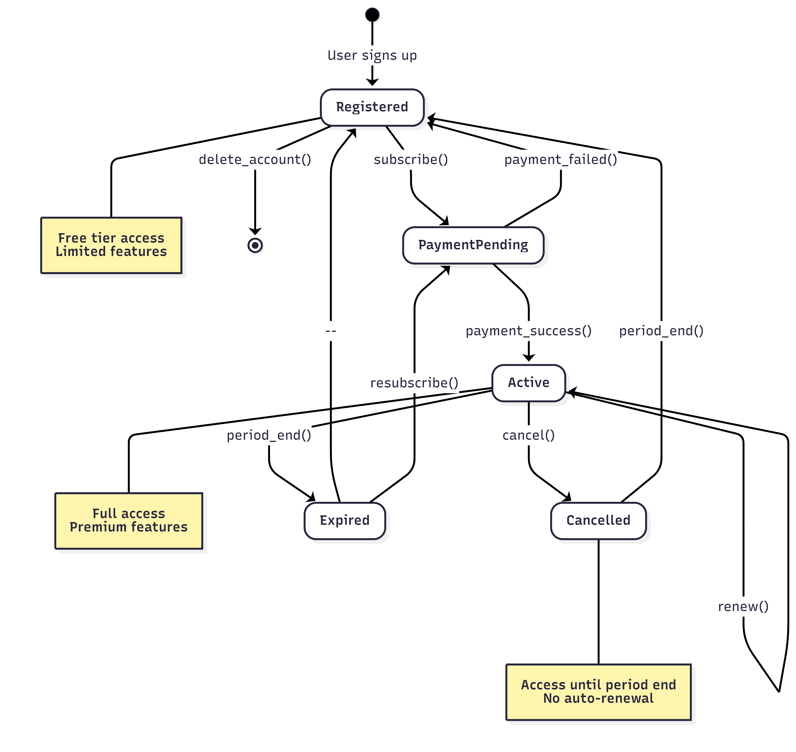
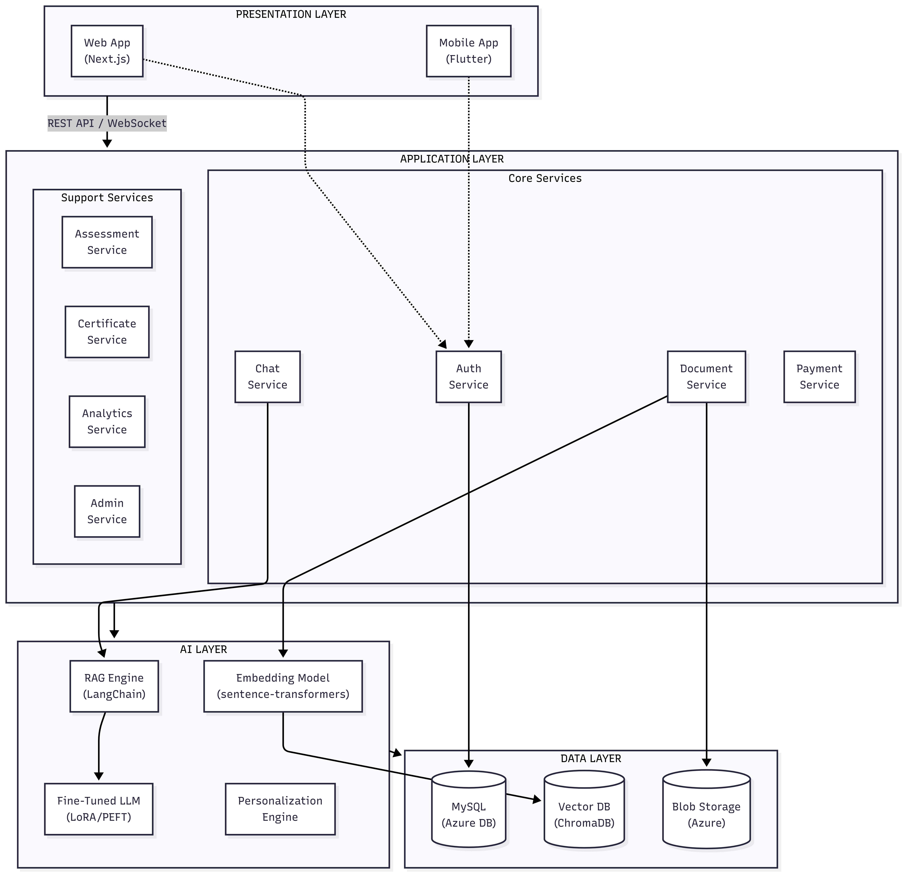

# Software Requirement Specification (SRS)
## AI Smart Skill Coach

---

| Document Information | |
|---------------------|---------------------------|
| **Document ID** | SRS-AISSC-001 |
| **Version** | 1.0 |
| **Date** | December 27, 2024 |
| **Status** | Draft |
| **Standard** | IEEE 830-1998 |
| **Author** | Senior Business Analyst |

---

# Table of Contents

1. [Introduction](#1-introduction)
2. [Overall Description](#2-overall-description)
3. [AI System Requirements](#3-ai-system-requirements)
4. [Functional Requirements](#4-functional-requirements)
5. [Non-Functional Requirements](#5-non-functional-requirements)
6. [External Interface Requirements](#6-external-interface-requirements)
7. [System Models & Diagrams](#7-system-models--diagrams)
8. [Data Requirements](#8-data-requirements)
9. [Appendices](#9-appendices)

---

# 1. Introduction

## 1.1 Purpose

Is Software Requirement Specification (SRS) document ka purpose AI Smart Skill Coach platform ke liye complete software requirements define karna hai. Ye document developers, testers, project managers, aur stakeholders ke liye ek comprehensive guide hai.

**Intended Audience:**
- Development Team
- QA/Testing Team
- Project Managers
- Product Owners
- Stakeholders

## 1.2 Scope

**AI Smart Skill Coach** ek AI-powered learning platform hai jo:

| Feature | Description |
|---------|-------------|
| Document-based Learning | Users apne PDFs/notes upload karke AI se Q&A kar sakte hain |
| RAG Technology | Retrieval Augmented Generation se accurate answers |
| Fine-tuned AI | Domain-specific expert AI (IT, Medical, Business) |
| Personalization | Learning progress, weak area detection |
| Certification | Paid assessments aur verified certificates |

**Out of Scope (v1.0):**
- Video/Audio content processing
- Live tutoring sessions
- Multi-language support
- Offline mode

## 1.3 Definitions, Acronyms, and Abbreviations

| Term | Definition |
|------|------------|
| **RAG** | Retrieval Augmented Generation - AI technique to retrieve relevant information from documents |
| **LLM** | Large Language Model - AI model for natural language processing |
| **LoRA** | Low-Rank Adaptation - Efficient fine-tuning technique |
| **PEFT** | Parameter-Efficient Fine-Tuning |
| **Vector DB** | Database storing document embeddings for similarity search |
| **Embedding** | Numerical representation of text for AI processing |
| **JWT** | JSON Web Token for authentication |
| **API** | Application Programming Interface |
| **SRS** | Software Requirement Specification |
| **MVP** | Minimum Viable Product |

## 1.4 References

| Document | Version |
|----------|---------|
| IEEE 830-1998 Standard | 1998 |
| Product Vision Document (PVD) | 1.0 |
| Business Requirements Document (BRD) | 1.0 |
| Market Analysis Document | 1.0 |

## 1.5 Document Overview

- **Section 2:** Overall product description
- **Section 3:** AI-specific system requirements
- **Section 4:** Functional requirements
- **Section 5:** Non-functional requirements
- **Section 6:** External interfaces
- **Section 7:** System diagrams
- **Section 8:** Data requirements
- **Section 9:** Appendices

---

# 2. Overall Description

## 2.1 Product Perspective

AI Smart Skill Coach ek standalone SaaS platform hai jo multiple components se milkar kaam karta hai:

## 2.2 Product Functions Summary

| ID | Function | Description |
|----|----------|-------------|
| PF-01 | User Management | Registration, login, profile |
| PF-02 | Document Management | Upload, process, organize |
| PF-03 | RAG Q&A System | Document-based question answering |
| PF-04 | Fine-tuned AI | Domain-specific responses |
| PF-05 | Personalization | Progress tracking, recommendations |
| PF-06 | Assessment | Quizzes, scoring |
| PF-07 | Certification | Certificate generation, verification |
| PF-08 | Payment | Subscriptions, payments |
| PF-09 | Admin Panel | User, content, revenue management |

## 2.3 User Classes and Characteristics (Updated for Multi-Tenancy)

### 2.3.1 B2C User Roles

| User Class | Description | Technical Level | Key Capabilities |
|------------|-------------|-----------------|------------------|
| **🎓 Student** | Individual learners, Exam aspirants | Basic | Upload docs, Chat, Take quizzes |
| **💼 Professional** | Self-directed upskilling, Career changers | Basic-Medium | Unlimited docs, Certificates, Portfolio |

### 2.3.2 B2B User Roles

| User Class | Description | Technical Level | Key Capabilities |
|------------|-------------|-----------------|------------------|
| **👨‍🏫 Educator** | Teachers, Coaches, Team Leads | Medium | Create Cohorts, Assign Content, View Student Progress, Generate Reports |
| **🏢 Org Admin** | School/Company Admin | Medium-High | Manage Seats, Billing, Invite Users, View Org Analytics |

### 2.3.3 System Roles

| User Class | Description | Technical Level | Key Capabilities |
|------------|-------------|-----------------|------------------|
| **Admin** | Platform content moderators | Medium-High | User mgmt, Content moderation |
| **Super Admin** | DevOps/System administrators | High | Full access, Config, Deployments |

### 2.3.4 RBAC Permission Matrix

| Permission | Student | Professional | Educator | Org Admin | Super Admin |
|------------|---------|--------------|----------|-----------|-------------|
| Upload Docs | ✅ | ✅ | ✅ | ❌ | ✅ |
| AI Chat | ✅ | ✅ | ✅ | ❌ | ✅ |
| Create Cohorts | ❌ | ❌ | ✅ | ❌ | ✅ |
| View Cohort Progress | ❌ | ❌ | ✅ | ✅ | ✅ |
| Manage Org Users | ❌ | ❌ | ❌ | ✅ | ✅ |
| Billing Access | ❌ | ❌ | ❌ | ✅ | ✅ |
| System Config | ❌ | ❌ | ❌ | ❌ | ✅ |

## 2.4 Operating Environment

| Component | Requirement |
|-----------|-------------|
| **Web Browser** | Chrome 90+, Firefox 88+, Safari 14+, Edge 90+ |
| **Mobile OS** | Android 8.0+, iOS 13.0+ |
| **Server** | Linux-based (Azure Container Apps) |
| **Database** | MySQL 8.0+ |
| **AI Runtime** | Python 3.10+, PyTorch 2.0+ |

## 2.5 Design and Implementation Constraints

| Constraint | Description |
|------------|-------------|
| AI Model Size | Must fit in available GPU memory |
| Response Time | AI responses within 5 seconds |
| File Size Limit | Max 50MB per document |
| Storage | Cloud-based (Azure Blob Storage) |
| Security | HTTPS, JWT authentication required |
| Payment | Stripe integration only |

## 2.6 Assumptions and Dependencies

**Assumptions:**
- Users have stable internet connection
- AI models remain available on Hugging Face
- Azure services maintain 99.9% uptime
- Stripe API remains functional

**Dependencies:**
- Hugging Face Transformers library
- LangChain framework
- ChromaDB/Weaviate vector database
- Stripe payment gateway
- Azure cloud services

---

# 3. AI System Requirements

## 3.1 RAG (Retrieval Augmented Generation) System

### 3.1.1 Document Processing Pipeline

| ID | Requirement | Priority | Acceptance Criteria |
|----|-------------|----------|---------------------|
| RAG-DP-01 | System shall accept PDF documents | High | PDF files up to 50MB processed successfully |
| RAG-DP-02 | System shall extract text from PDFs | High | 95%+ text extraction accuracy |
| RAG-DP-03 | System shall handle scanned PDFs (OCR) | Medium | OCR integration for image-based PDFs |
| RAG-DP-04 | System shall preserve document structure | Medium | Headings, paragraphs maintained |
| RAG-DP-05 | System shall extract metadata | Low | Title, author, page count extracted |

### 3.1.2 Text Chunking Requirements

| ID | Requirement | Priority | Acceptance Criteria |
|----|-------------|----------|---------------------|
| RAG-CH-01 | System shall split documents into chunks | High | Chunks of 500-1000 tokens |
| RAG-CH-02 | System shall maintain semantic coherence | High | Chunks don't break mid-sentence |
| RAG-CH-03 | System shall implement chunk overlap | Medium | 10-20% overlap between chunks |
| RAG-CH-04 | System shall preserve chunk metadata | Medium | Page number, section stored |

### 3.1.3 Embedding Generation Requirements

| ID | Requirement | Priority | Acceptance Criteria |
|----|-------------|----------|---------------------|
| RAG-EM-01 | System shall generate embeddings for chunks | High | Using sentence-transformers |
| RAG-EM-02 | System shall use consistent embedding model | High | all-MiniLM-L6-v2 or similar |
| RAG-EM-03 | Embedding dimension shall be standardized | Medium | 384 or 768 dimensions |
| RAG-EM-04 | System shall batch process embeddings | Medium | Efficient batch generation |

### 3.1.4 Vector Storage Requirements

| ID | Requirement | Priority | Acceptance Criteria |
|----|-------------|----------|---------------------|
| RAG-VS-01 | System shall store embeddings in vector DB | High | ChromaDB/Weaviate integration |
| RAG-VS-02 | System shall isolate user data | High | Multi-tenant data separation |
| RAG-VS-03 | System shall support metadata filtering | Medium | Filter by document, date, etc. |
| RAG-VS-04 | System shall enable fast similarity search | High | <100ms response time |

### 3.1.5 Retrieval Requirements

| ID | Requirement | Priority | Acceptance Criteria |
|----|-------------|----------|---------------------|
| RAG-RT-01 | System shall retrieve relevant chunks | High | Top-K retrieval (K=5-10) |
| RAG-RT-02 | System shall rank by similarity score | High | Cosine similarity ranking |
| RAG-RT-03 | System shall support hybrid search | Medium | Dense + sparse retrieval |
| RAG-RT-04 | System shall implement re-ranking | Low | Cross-encoder re-ranking |

### 3.1.6 Response Generation Requirements

| ID | Requirement | Priority | Acceptance Criteria |
|----|-------------|----------|---------------------|
| RAG-RG-01 | System shall generate answer from context | High | LLM uses retrieved chunks |
| RAG-RG-02 | System shall cite sources | High | Page/section reference |
| RAG-RG-03 | System shall prevent hallucination | High | Answer only from context |
| RAG-RG-04 | System shall handle "no answer found" | High | Graceful fallback message |

---

## 3.2 Fine-Tuning System Requirements

### 3.2.1 Base Model Requirements

| ID | Requirement | Priority | Acceptance Criteria |
|----|-------------|----------|---------------------|
| FT-BM-01 | System shall use open-source LLM | High | Llama/Mistral/Phi models |
| FT-BM-02 | Model size shall be optimized | High | 7B parameters or less |
| FT-BM-03 | Model shall support instruction tuning | High | Chat/instruction format |

### 3.2.2 LoRA/PEFT Requirements

| ID | Requirement | Priority | Acceptance Criteria |
|----|-------------|----------|---------------------|
| FT-LR-01 | System shall implement LoRA adapters | High | Hugging Face PEFT library |
| FT-LR-02 | LoRA rank shall be configurable | Medium | Rank 8-64 supported |
| FT-LR-03 | System shall support multiple adapters | High | Domain-specific adapters |
| FT-LR-04 | Adapters shall be hot-swappable | Medium | Dynamic loading |

### 3.2.3 Domain Adapter Requirements

| ID | Requirement | Priority | Acceptance Criteria |
|----|-------------|----------|---------------------|
| FT-DA-01 | IT domain adapter | High | Programming, tech concepts |
| FT-DA-02 | Medical domain adapter | Medium | Medical terminology |
| FT-DA-03 | Business domain adapter | Medium | Business concepts |
| FT-DA-04 | Academic domain adapter | Low | General education |

### 3.2.4 Training Pipeline Requirements

| ID | Requirement | Priority | Acceptance Criteria |
|----|-------------|----------|---------------------|
| FT-TP-01 | System shall support training data upload | Medium | JSON/JSONL format |
| FT-TP-02 | System shall validate training data | Medium | Format, quality checks |
| FT-TP-03 | Training shall be configurable | Low | Epochs, learning rate |
| FT-TP-04 | Training progress shall be tracked | Low | Loss metrics, checkpoints |

---

## 3.3 Personalization Engine Requirements

### 3.3.1 Learning Analytics

| ID | Requirement | Priority | Acceptance Criteria |
|----|-------------|----------|---------------------|
| PE-LA-01 | System shall track questions asked | High | Store Q&A history |
| PE-LA-02 | System shall track time per topic | Medium | Session duration logging |
| PE-LA-03 | System shall track quiz performance | High | Scores, wrong answers |
| PE-LA-04 | System shall calculate skill levels | Medium | Per-topic proficiency |

### 3.3.2 Weak Area Detection

| ID | Requirement | Priority | Acceptance Criteria |
|----|-------------|----------|---------------------|
| PE-WA-01 | System shall identify weak topics | High | Based on quiz errors |
| PE-WA-02 | System shall score weakness severity | Medium | 1-10 weakness scale |
| PE-WA-03 | System shall update weak areas dynamically | Medium | Real-time updates |

### 3.3.3 Recommendation Engine

| ID | Requirement | Priority | Acceptance Criteria |
|----|-------------|----------|---------------------|
| PE-RE-01 | System shall recommend study topics | High | Based on weak areas |
| PE-RE-02 | System shall suggest revision | Medium | Spaced repetition logic |
| PE-RE-03 | System shall generate study plans | Low | Daily/weekly suggestions |

---

## 3.4 AI Performance Metrics

| Metric | Target | Measurement Method |
|--------|--------|-------------------|
| Response Accuracy | >90% | User feedback, manual review |
| Hallucination Rate | <5% | Source verification |
| Response Latency | <5 seconds | API response time |
| Retrieval Precision | >85% | Relevance scoring |
| User Satisfaction | >4.5/5 | In-app ratings |

---

# 4. Functional Requirements

## 4.1 User Management (FR-UM)

| ID | Requirement | Priority | Description |
|----|-------------|----------|-------------|
| FR-UM-01 | User Registration | High | Email/password + social OAuth |
| FR-UM-02 | User Login | High | JWT-based authentication |
| FR-UM-03 | Password Reset | High | Email-based recovery |
| FR-UM-04 | Profile Management | High | Edit name, avatar, preferences |
| FR-UM-05 | Email Verification | Medium | Verify email address |
| FR-UM-06 | Account Deletion | Medium | GDPR compliant deletion |
| FR-UM-07 | Session Management | Medium | Remember me, logout |

---

## 4.2 Document Management (FR-DM)

| ID | Requirement | Priority | Description |
|----|-------------|----------|-------------|
| FR-DM-01 | Document Upload | High | Drag & drop, file selector |
| FR-DM-02 | Multiple Formats | Medium | PDF, DOCX, TXT support |
| FR-DM-03 | File Size Limit | High | Max 50MB per file |
| FR-DM-04 | Document List | High | View all uploaded documents |
| FR-DM-05 | Document Delete | High | Remove document and vectors |
| FR-DM-06 | Document Preview | Medium | In-app viewer |
| FR-DM-07 | Folder Organization | Low | Create folders, move docs |
| FR-DM-08 | Storage Quota | High | Limit based on plan |

---

## 4.3 AI Chat System (FR-AC)

| ID | Requirement | Priority | Description |
|----|-------------|----------|-------------|
| FR-AC-01 | Ask Question | High | Natural language input |
| FR-AC-02 | Context Selection | High | Select documents for context |
| FR-AC-03 | AI Response | High | Accurate answer with sources |
| FR-AC-04 | Chat History | High | View past conversations |
| FR-AC-05 | Copy Response | Medium | Copy answer to clipboard |
| FR-AC-06 | Feedback Rating | Medium | Thumbs up/down for responses |
| FR-AC-07 | Follow-up Questions | High | Multi-turn conversation |
| FR-AC-08 | Domain Selection | Medium | Choose AI domain (IT, Medical) |

---

## 4.4 Assessment System (FR-AS)

| ID | Requirement | Priority | Description |
|----|-------------|----------|-------------|
| FR-AS-01 | Quiz List | High | Browse available quizzes |
| FR-AS-02 | Quiz Attempt | High | Start and complete quiz |
| FR-AS-03 | Question Types | High | MCQ, True/False |
| FR-AS-04 | Timer | Medium | Time limit per quiz |
| FR-AS-05 | Auto-scoring | High | Instant score calculation |
| FR-AS-06 | Results Review | High | View correct/wrong answers |
| FR-AS-07 | Attempt History | Medium | Past quiz attempts |
| FR-AS-08 | Paid Quiz Lock | High | Premium quizzes locked |

---

## 4.5 Certification System (FR-CS)

| ID | Requirement | Priority | Description |
|----|-------------|----------|-------------|
| FR-CS-01 | Certificate Eligibility | High | 80%+ score required |
| FR-CS-02 | Certificate Generation | High | PDF with details |
| FR-CS-03 | Unique Certificate ID | High | Verifiable unique code |
| FR-CS-04 | QR Code | Medium | Scannable verification |
| FR-CS-05 | Download | High | PDF download |
| FR-CS-06 | Share | Medium | Social media sharing |
| FR-CS-07 | Verification Page | High | Public verification URL |

---

## 4.6 Payment System (FR-PM)

| ID | Requirement | Priority | Description |
|----|-------------|----------|-------------|
| FR-PM-01 | Plan Selection | High | View subscription plans |
| FR-PM-02 | Checkout | High | Stripe checkout session |
| FR-PM-03 | Payment Processing | High | Secure card payment |
| FR-PM-04 | Subscription Activation | High | Webhook-based activation |
| FR-PM-05 | Plan Upgrade/Downgrade | Medium | Change subscription |
| FR-PM-06 | Cancel Subscription | Medium | User cancellation |
| FR-PM-07 | Invoice History | Medium | Past invoices |
| FR-PM-08 | Payment Receipt | Medium | Email confirmation |

---

## 4.7 Admin Panel (FR-AP)

| ID | Requirement | Priority | Description |
|----|-------------|----------|-------------|
| FR-AP-01 | Dashboard | High | Overview stats |
| FR-AP-02 | User Management | High | View, edit, suspend users |
| FR-AP-03 | Content Management | Medium | Review content |
| FR-AP-04 | Quiz Management | Medium | Create, edit quizzes |
| FR-AP-05 | Revenue Reports | High | Earnings, subscriptions |
| FR-AP-06 | Analytics | Medium | Usage statistics |
| FR-AP-07 | Certificate Management | Medium | View issued certs |
| FR-AP-08 | System Settings | Low | Configure limits |

---

# 5. Non-Functional Requirements

## 5.1 Performance Requirements (NFR-PR)

| ID | Requirement | Target |
|----|-------------|--------|
| NFR-PR-01 | Page Load Time | < 3 seconds |
| NFR-PR-02 | AI Response Time | < 5 seconds |
| NFR-PR-03 | API Response Time | < 500ms |
| NFR-PR-04 | Concurrent Users | 1000+ |
| NFR-PR-05 | Document Processing | < 30 seconds for 50MB |
| NFR-PR-06 | Database Query Time | < 100ms |

## 5.2 Security Requirements (NFR-SC)

| ID | Requirement | Description |
|----|-------------|-------------|
| NFR-SC-01 | HTTPS Encryption | All traffic encrypted |
| NFR-SC-02 | JWT Authentication | Secure token-based auth |
| NFR-SC-03 | Password Hashing | bcrypt with salt |
| NFR-SC-04 | Data Encryption at Rest | Sensitive data encrypted |
| NFR-SC-05 | Input Validation | Prevent SQL injection, XSS |
| NFR-SC-06 | Rate Limiting | API rate limits |
| NFR-SC-07 | CORS Policy | Restricted origins |
| NFR-SC-08 | PCI Compliance | Stripe handles card data |

## 5.3 Reliability Requirements (NFR-RL)

| ID | Requirement | Target |
|----|-------------|--------|
| NFR-RL-01 | System Uptime | 99.5% |
| NFR-RL-02 | Data Backup | Daily automated backups |
| NFR-RL-03 | Disaster Recovery | RTO < 4 hours |
| NFR-RL-04 | Error Handling | Graceful error messages |

## 5.4 Scalability Requirements (NFR-SL)

| ID | Requirement | Description |
|----|-------------|-------------|
| NFR-SL-01 | Horizontal Scaling | Add more containers |
| NFR-SL-02 | Database Scaling | Read replicas support |
| NFR-SL-03 | Storage Scaling | Auto-scaling blob storage |
| NFR-SL-04 | AI Model Scaling | Multiple GPU instances |

## 5.5 Usability Requirements (NFR-US)

| ID | Requirement | Description |
|----|-------------|-------------|
| NFR-US-01 | Intuitive UI | No training required |
| NFR-US-02 | Responsive Design | Works on all devices |
| NFR-US-03 | Accessibility | WCAG 2.1 AA compliance |
| NFR-US-04 | Error Messages | Clear, actionable errors |
| NFR-US-05 | Loading States | Visual feedback |

## 5.6 Maintainability Requirements (NFR-MT)

| ID | Requirement | Description |
|----|-------------|-------------|
| NFR-MT-01 | Modular Architecture | Microservices structure |
| NFR-MT-02 | Code Documentation | Inline comments, API docs |
| NFR-MT-03 | Logging | Structured logging |
| NFR-MT-04 | Monitoring | Azure Monitor integration |
| NFR-MT-05 | Version Control | Git-based workflow |

---

# 6. External Interface Requirements

## 6.1 User Interfaces

### 6.1.1 Web Application Screens

| Screen | Description |
|--------|-------------|
| Landing Page | Product overview, pricing |
| Login/Register | Authentication forms |
| Dashboard | User overview, quick actions |
| Document Upload | File upload interface |
| AI Chat | Q&A conversation interface |
| Quiz Page | Assessment interface |
| Certificate | Certificate viewer |
| Settings | User preferences |
| Subscription | Plan management |

### 6.1.2 Mobile Application Screens

| Screen | Description |
|--------|-------------|
| Onboarding | App introduction |
| Login/Register | Mobile authentication |
| Home | Dashboard view |
| Documents | Document list |
| Chat | AI conversation |
| Progress | Learning analytics |
| Profile | User settings |

## 6.2 Hardware Interfaces

| Interface | Description |
|-----------|-------------|
| Camera | Document scanning (mobile) |
| File System | Document upload access |
| Network | Internet connectivity |

## 6.3 Software Interfaces

| Interface | Purpose | Protocol |
|-----------|---------|----------|
| Stripe API | Payment processing | REST/HTTPS |
| Hugging Face API | AI models | REST/HTTPS |
| Azure Blob Storage | File storage | Azure SDK |
| Azure Database | MySQL access | MySQL protocol |
| ChromaDB/Weaviate | Vector storage | REST/gRPC |

## 6.4 Communication Interfaces

| Interface | Protocol | Description |
|-----------|----------|-------------|
| REST API | HTTPS | Client-server communication |
| WebSocket | WSS | Real-time chat updates |
| Email SMTP | SMTP/TLS | Transactional emails |
| Push Notifications | FCM/APNs | Mobile notifications |

---

# 7. System Models & Diagrams

## 7.1 Use Case Diagram

---

## 7.2 Data Flow Diagram (DFD) - Level 0

---

## 7.3 Data Flow Diagram (DFD) - Level 1

---

## 7.4 RAG System Flow Diagram

---

## 7.5 Sequence Diagram - User Q&A Flow

---

## 7.6 Sequence Diagram - Payment Flow

---

## 7.7 State Machine Diagram - User Subscription

---

## 7.8 Component Diagram

---

# 8. Data Requirements

## 8.1 Data Dictionary

### 8.1.1 User Entity

| Field | Type | Constraints | Description |
|-------|------|-------------|-------------|
| id | UUID | PK | Unique identifier |
| email | VARCHAR(255) | UNIQUE, NOT NULL | User email |
| password_hash | VARCHAR(255) | NOT NULL | Hashed password |
| name | VARCHAR(100) | NOT NULL | Full name |
| avatar_url | VARCHAR(500) | NULL | Profile image |
| role | ENUM | DEFAULT 'user' | user, admin, super_admin |
| subscription_status | ENUM | DEFAULT 'free' | free, pro, premium, enterprise |
| subscription_end_date | DATETIME | NULL | Expiry date |
| created_at | DATETIME | NOT NULL | Registration date |
| updated_at | DATETIME | NOT NULL | Last update |

### 8.1.2 Document Entity

| Field | Type | Constraints | Description |
|-------|------|-------------|-------------|
| id | UUID | PK | Unique identifier |
| user_id | UUID | FK | Owner user |
| filename | VARCHAR(255) | NOT NULL | Original filename |
| file_path | VARCHAR(500) | NOT NULL | Storage path |
| file_size | BIGINT | NOT NULL | Size in bytes |
| mime_type | VARCHAR(100) | NOT NULL | File type |
| status | ENUM | DEFAULT 'processing' | processing, ready, failed |
| chunk_count | INT | NULL | Number of chunks |
| created_at | DATETIME | NOT NULL | Upload date |

### 8.1.3 Chat History Entity

| Field | Type | Constraints | Description |
|-------|------|-------------|-------------|
| id | UUID | PK | Unique identifier |
| user_id | UUID | FK | User reference |
| session_id | UUID | NOT NULL | Chat session |
| question | TEXT | NOT NULL | User question |
| answer | TEXT | NOT NULL | AI response |
| sources | JSON | NULL | Source references |
| feedback | ENUM | NULL | positive, negative |
| created_at | DATETIME | NOT NULL | Timestamp |

### 8.1.4 Quiz Attempt Entity

| Field | Type | Constraints | Description |
|-------|------|-------------|-------------|
| id | UUID | PK | Unique identifier |
| user_id | UUID | FK | User reference |
| quiz_id | UUID | FK | Quiz reference |
| score | DECIMAL(5,2) | NOT NULL | Percentage score |
| passed | BOOLEAN | NOT NULL | Pass/fail |
| answers | JSON | NOT NULL | User answers |
| time_taken | INT | NOT NULL | Seconds taken |
| created_at | DATETIME | NOT NULL | Attempt date |

### 8.1.5 Certificate Entity

| Field | Type | Constraints | Description |
|-------|------|-------------|-------------|
| id | UUID | PK | Unique identifier |
| user_id | UUID | FK | User reference |
| quiz_id | UUID | FK | Quiz reference |
| certificate_number | VARCHAR(50) | UNIQUE | Verification code |
| issue_date | DATE | NOT NULL | Issue date |
| pdf_path | VARCHAR(500) | NOT NULL | PDF storage path |

---

## 8.2 Entity Relationship Overview

---
# 9. Appendices
## 9.1 Glossary
| Term | Definition |
|------|------------|
| **Chunk** | Document ka chota hissa jo vector DB mein store hota hai |
| **Embedding** | Text ka numerical vector representation |
| **Hallucination** | AI ka galat ya made-up answer dena |
| **RAG** | Technique jo documents se relevant info retrieve kar ke answer generate karti hai |
| **Fine-tuning** | Pre-trained model ko specific data pe train karna |
| **LoRA** | Efficient fine-tuning method jo kam resources use karta hai |
| **Vector Database** | Database jo embeddings store aur search karta hai |

## 9.2 Acronyms

| Acronym | Full Form |
|---------|-----------|
| AI | Artificial Intelligence |
| API | Application Programming Interface |
| CRUD | Create, Read, Update, Delete |
| DFD | Data Flow Diagram |
| JWT | JSON Web Token |
| LLM | Large Language Model |
| ML | Machine Learning |
| MVP | Minimum Viable Product |
| NLP | Natural Language Processing |
| PEFT | Parameter-Efficient Fine-Tuning |
| RAG | Retrieval Augmented Generation |
| REST | Representational State Transfer |
| SaaS | Software as a Service |
| SRS | Software Requirement Specification |
| UI | User Interface |
| UX | User Experience |

## 9.3 Version History

| Version | Date | Author | Changes |
|---------|------|--------|---------|
| 1.0 | Dec 27, 2024 | Senior BA | Initial draft |

## 9.4 Approval

| Role | Name | Signature | Date |
|------|------|-----------|------|
| Business Analyst | | | |
| Project Manager | | | |
| Technical Lead | | | |
| Product Owner | | | |

---

*Document Version: 1.0 | Last Updated: December 27, 2024*
*Standard: IEEE 830-1998*
