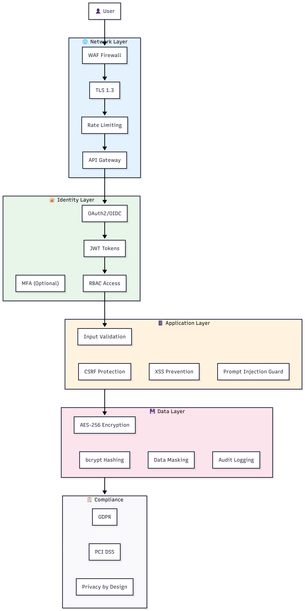
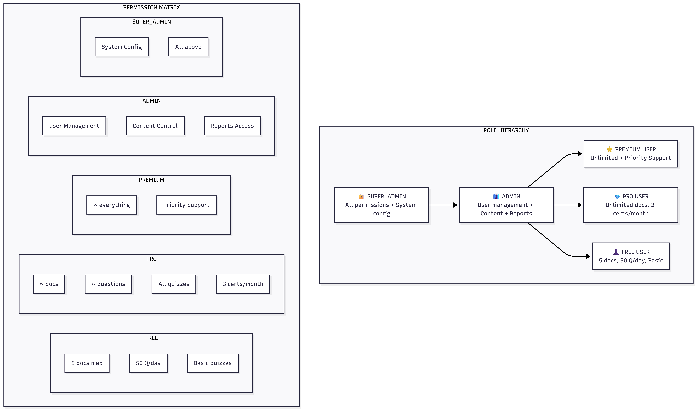

# Enhanced Security Requirements
## AI Smart Skill Coach - SRS Appendix

---

## 1. Comprehensive Security Architecture

### 1.1 Zero-Trust Security Model

---

## 2. Authentication & Authorization Requirements

### 2.1 Authentication (AuthN)

| ID | Requirement | Priority | Description |
|----|-------------|----------|-------------|
| SEC-AUTH-01 | JWT Token Authentication | High | Access tokens (15min), Refresh tokens (7days) |
| SEC-AUTH-02 | OAuth2/OIDC Support | High | Google, GitHub social login |
| SEC-AUTH-03 | Password Policy | High | Min 8 chars, uppercase, number, special char |
| SEC-AUTH-04 | Password Hashing | High | bcrypt with cost factor 12 |
| SEC-AUTH-05 | Session Management | High | Secure, HttpOnly, SameSite cookies |
| SEC-AUTH-06 | Account Lockout | Medium | Lock after 5 failed attempts (30min) |
| SEC-AUTH-07 | MFA Support | Medium | TOTP-based 2FA (optional) |

### 2.2 Authorization (AuthZ) - RBAC Model

---

## 3. Data Protection & GDPR Compliance

### 3.1 Data Classification

| Level | Data Type | Protection |
|-------|-----------|------------|
| **Critical** | Passwords, Payment info | Hashed/Tokenized, Never stored raw |
| **Confidential** | User documents, Chat history | Encrypted at rest (AES-256) |
| **Internal** | User profile, Progress data | Access controlled, Encrypted |
| **Public** | Certificates (verification) | Integrity protected |

### 3.2 GDPR Compliance Requirements

| ID | Requirement | Description |
|----|-------------|-------------|
| GDPR-01 | Consent Management | Explicit consent for data processing |
| GDPR-02 | Data Minimization | Collect only necessary data |
| GDPR-03 | Right to Access | Users can download their data |
| GDPR-04 | Right to Erasure | Complete data deletion on request |
| GDPR-05 | Data Portability | Export data in JSON/CSV format |
| GDPR-06 | Privacy by Design | Security built into architecture |
| GDPR-07 | Data Retention | Auto-delete after 30 days of account deletion |
| GDPR-08 | Breach Notification | Notify within 72 hours of breach |

---

## 4. AI-Specific Security

### 4.1 AI Security Requirements

| ID | Requirement | Priority | Description |
|----|-------------|----------|-------------|
| AI-SEC-01 | Data Isolation | High | User documents isolated per tenant |
| AI-SEC-02 | Prompt Injection Prevention | High | Input sanitization before LLM |
| AI-SEC-03 | Output Filtering | High | Filter sensitive data from responses |
| AI-SEC-04 | Model Access Control | Medium | API key rotation, rate limiting |
| AI-SEC-05 | Audit Logging | High | Log all AI queries for review |

### 4.2 Organization-Level Security (B2B)

| ID | Requirement | Priority | Description |
|----|-------------|----------|-------------|
| ORG-SEC-01 | **Tenant Isolation** | Critical | Org A CANNOT see Org B's data. Enforced at DB query level. |
| ORG-SEC-02 | **Vector DB Namespace** | High | Separate ChromaDB namespaces per `org_id` to prevent RAG cross-contamination. |
| ORG-SEC-03 | **SSO/SAML Support** | Medium | Enterprise orgs can use their Identity Provider. |
| ORG-SEC-04 | **IP Whitelisting** | Low | Optional for high-security orgs. |

### 4.3 Educator-Specific Security

| ID | Requirement | Priority | Description |
|----|-------------|----------|-------------|
| EDU-SEC-01 | Cohort Data Access | High | Educators can ONLY see students in their cohorts. |
| EDU-SEC-02 | Content Ownership | Medium | Educators retain ownership of uploaded curriculum. |

---

## 5. Security Audit & Monitoring

| Requirement | Description |
|-------------|-------------|
| Security Logging | All auth events, access attempts logged |
| Anomaly Detection | Unusual login patterns flagged |
| Vulnerability Scanning | Weekly automated scans |
| Penetration Testing | Annual third-party testing |
| Incident Response | Documented response procedures |

---

*This document extends SRS Section 5.2 Security Requirements*
