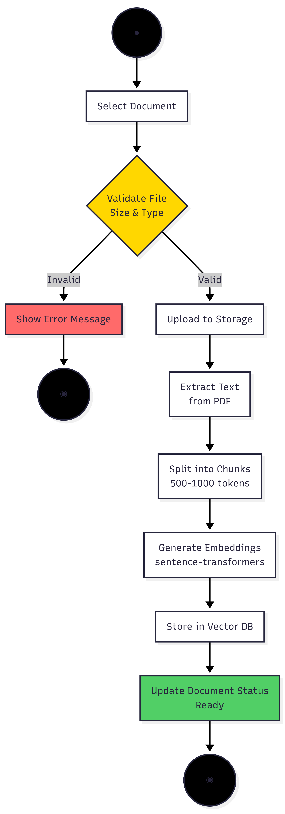
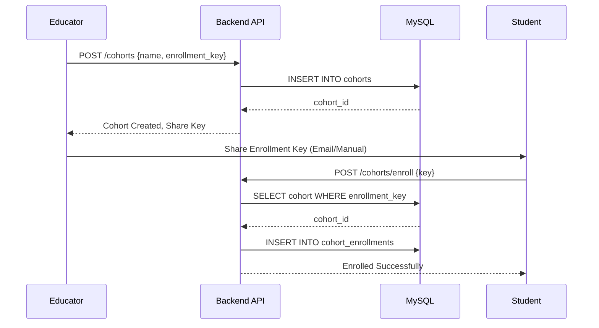
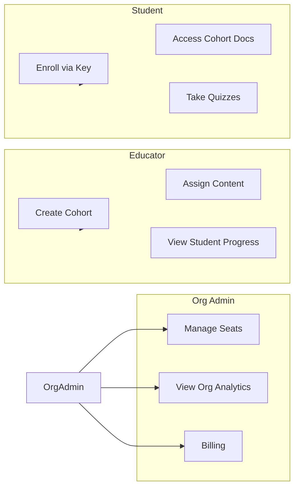

# Enhanced UML Diagrams
## AI Smart Skill Coach - SRS Appendix

---

| Document Information | |
|---------------------|---------------------------|
| **Document ID** | SRS-UML-AISSC-002 |
| **Version** | 2.0 |
| **Date** | December 28, 2024 |
| **Author** | Senior Software Engineer |

---

## 1. Class Diagram

---

## 2. Activity Diagram - Document Upload & Processing

---

## 3. Activity Diagram - Quiz & Certification Flow

---

## 4. Sequence Diagram - Authentication Flow

---

## 5. New: Sequence Diagram - Cohort Enrollment (Educator Flow)

---

## 6. New: Use Case Diagram - B2B Actors

---

*This document extends SRS Section 7 System Models & Diagrams - Version 2.0*
