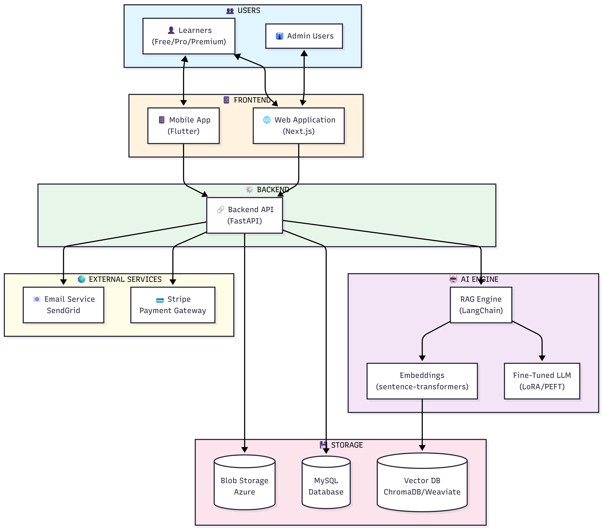
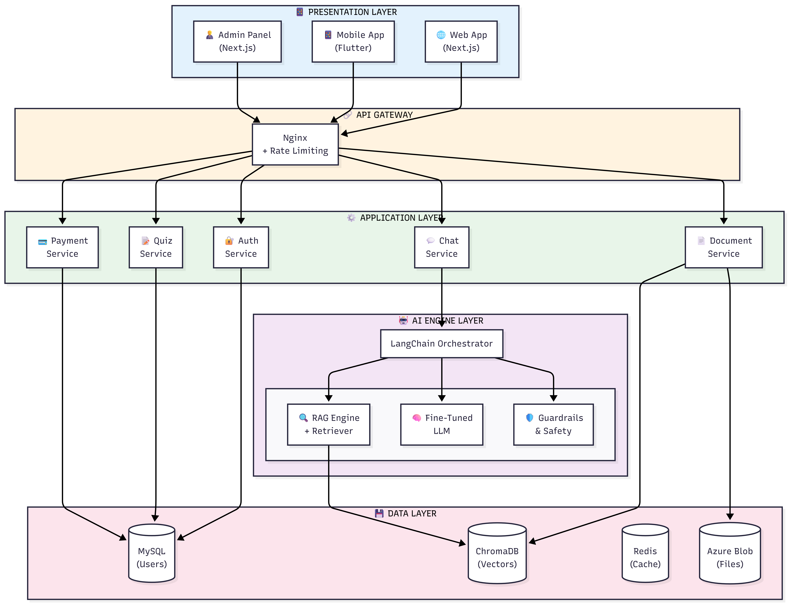

# System Design Document (SDD)
## AI Smart Skill Coach

---

| Document Information | |
|---------------------|---------------------------|
| **Document ID** | SDD-AISSC-001 |
| **Version** | 2.0 |
| **Date** | December 27, 2024 |
| **Status** | Draft |
| **Standard** | IEEE 1016-2009 |
| **Author** | Senior System Designer & PM |

---

# Table of Contents

1. [Introduction](#1-introduction)
2. [System Overview](#2-system-overview)
3. [Design Considerations](#3-design-considerations)
4. [System Architecture](#4-system-architecture)
5. [Component Design](#5-component-design)
6. [Data Design](#6-data-design)
7. [Interface Design](#7-interface-design)
8. [User Interface Design](#8-user-interface-design)
9. [Security Design](#9-security-design)
10. [Performance Design](#10-performance-design)
11. [Deployment Design](#11-deployment-design)
12. [Implementation Plan](#12-implementation-plan)
13. [Testing Strategy](#13-testing-strategy)
14. [Risks & Mitigation](#14-risks--mitigation)
15. [Appendices](#15-appendices)

---

# 1. Introduction

## 1.1 Purpose

Is System Design Document (SDD) ka purpose AI Smart Skill Coach ke complete technical design ko document karna hai. Ye document IEEE 1016-2009 standard ke mutabiq banaya gaya hai.

**Document Objectives:**
- System architecture define karna
- Component interactions describe karna
- Technical decisions document karna
- Implementation guidance provide karna

## 1.2 Scope

| In Scope | Out of Scope |
|----------|--------------|
| System Architecture | Detailed Code Implementation |
| Component Design | Unit Test Cases |
| Database Schema | User Training Material |
| API Specifications | Marketing Content |
| Security Architecture | Operational Procedures |
| Deployment Architecture | Budget Details |

## 1.3 Intended Audience

| Audience | Purpose |
|----------|---------|
| **Development Team** | Implementation guidance |
| **DevOps Engineers** | Deployment planning |
| **QA Engineers** | Test planning |
| **Project Managers** | Resource planning |
| **Technical Leads** | Architecture review |
| **Stakeholders** | Technical understanding |

## 1.4 Reference Documents

| Document | Version | Description |
|----------|---------|-------------|
| Product Vision Document (PVD) | 1.0 | Business vision & goals |
| Business Requirements Document (BRD) | 1.0 | Business requirements |
| Software Requirement Specification (SRS) | 1.0 | Functional & non-functional requirements |
| AI Requirements Specification (AI-RS) | 2.0 | RAG, Fine-Tuning, Guardrails |
| Enhanced Security Requirements | 1.0 | Security architecture |
| Enhanced Data Model (ERD) | 1.0 | Database schema |

---

# 2. System Overview

## 2.1 Product Description

**AI Smart Skill Coach** ek AI-powered learning platform hai with:

| Feature | Technology | Benefit |
|---------|------------|---------|
| **Document-based Learning** | RAG Pipeline | Accurate answers from user's documents |
| **Domain Expert AI** | Fine-Tuned LLM | IT, Medical, Business expertise |
| **Personalization** | ML Analytics | Weak area detection, recommendations |
| **Certification** | Assessment Engine | Verified certificates |
| **Monetization** | Stripe Integration | Subscription & pay-per-cert |

## 2.2 System Context



## 2.3 Design Goals & Principles

| Principle | Application |
|-----------|-------------|
| **Microservices** | Independent, scalable services |
| **API-First** | Well-documented REST APIs |
| **Security-First** | Zero-Trust, encryption by default |
| **Cloud-Native** | Containerized, auto-scaling |
| **AI-First** | AI at the core of every feature |

## 2.4 Technology Stack

| Layer | Technology | Justification |
|-------|------------|---------------|
| **Frontend Web** | Next.js 14 | SSR, SEO, React ecosystem |
| **Frontend Mobile** | Flutter | Cross-platform, single codebase |
| **API Gateway** | Nginx | Load balancing, SSL termination |
| **Backend** | Python FastAPI | Async, AI/ML ecosystem |
| **AI Engine** | LangChain | RAG orchestration |
| **LLM (RAG)** | Gemini 1.5 Flash | 1M context, free tier |
| **LLM (Fine-Tuned)** | Mistral 7B + LoRA | Domain-specific |
| **Vector DB** | ChromaDB | Embeddings storage |
| **Database** | MySQL 8.0 | Relational data |
| **Cache** | Redis | Session, response cache |
| **Storage** | Azure Blob | Documents, files |
| **Container** | Docker + K8s | Orchestration |
| **Cloud** | Azure | Enterprise-grade |

---

# 3. Design Considerations

## 3.1 Assumptions

| # | Assumption |
|---|------------|
| 1 | Users have stable internet connection |
| 2 | Modern browsers with JavaScript enabled |
| 3 | PDF documents are primarily text-based |
| 4 | Google AI Studio API remains available |
| 5 | Azure services remain within budget |

## 3.2 Constraints

| Constraint | Impact | Mitigation |
|------------|--------|------------|
| AI Response Time | Max 5 sec | Caching, model optimization |
| File Size | Max 50 MB | Chunked upload |
| GPU Memory | 24 GB | Quantized models |
| Budget | Limited | Start with free tiers |
| Team Size | Small | Prioritize core features |

## 3.3 Dependencies

| Dependency | Type | Risk Level |
|------------|------|------------|
| Google AI (Gemini) | External API | Medium |
| Stripe | Payment Gateway | Low |
| Azure | Cloud Provider | Low |
| Hugging Face | Model Hub | Low |
| SendGrid | Email Service | Low |

---

# 4. System Architecture

## 4.1 High-Level Architecture


## 4.2 Architecture Layers



## 4.3 Component Communication

| From | To | Protocol | Pattern |
|------|----|----------|---------|
| Frontend | API Gateway | HTTPS | Request/Response |
| API Gateway | Services | HTTP | REST |
| Services | Database | TCP | Connection Pool |
| Chat Service | AI Engine | Async | Message Queue |
| AI Engine | LLM API | HTTPS | Request/Response |

---

# 5. Component Design

## 5.1 Authentication Service

| Aspect | Design |
|--------|--------|
| **Port** | 8001 |
| **Technology** | FastAPI + JWT |
| **Database** | MySQL (users table) |

**Responsibilities:**
- User registration & login
- JWT token generation & validation
- OAuth integration (Google, GitHub)
- Password reset flow
- Session management

**API Endpoints:**
| Method | Endpoint | Description |
|--------|----------|-------------|
| POST | `/auth/register` | User registration |
| POST | `/auth/login` | User login |
| POST | `/auth/refresh` | Refresh token |
| POST | `/auth/logout` | Logout |
| POST | `/auth/forgot-password` | Password reset |

---

## 5.2 Document Service

| Aspect | Design |
|--------|--------|
| **Port** | 8002 |
| **Technology** | FastAPI + PyPDF2 |
| **Storage** | Azure Blob + ChromaDB |

**Responsibilities:**
- File upload & validation
- Text extraction (PDF, DOCX, TXT)
- Text chunking & embedding
- Vector storage


**API Endpoints:**
| Method | Endpoint | Description |
|--------|----------|-------------|
| POST | `/documents/upload` | Upload document |
| GET | `/documents` | List user documents |
| GET | `/documents/{id}` | Get document details |
| DELETE | `/documents/{id}` | Delete document |
| GET | `/documents/{id}/status` | Processing status |

---

## 5.3 Chat Service (AI Q&A)

| Aspect | Design |
|--------|--------|
| **Port** | 8003 |
| **Technology** | FastAPI + LangChain |
| **AI Provider** | Gemini 1.5 Flash |

**Responsibilities:**
- Process user questions
- RAG pipeline orchestration
- Response generation
- Conversation history

**RAG Flow:**
```
User Question
     ↓
Query Embedding (sentence-transformers)
     ↓
Vector Search (ChromaDB - top 5 chunks)
     ↓
Context Assembly
     ↓
LLM Call (Gemini 1.5 Flash)
     ↓
Response with Citations
```

**API Endpoints:**
| Method | Endpoint | Description |
|--------|----------|-------------|
| POST | `/chat/query` | Ask question |
| GET | `/chat/history` | Get history |
| POST | `/chat/feedback` | Submit feedback |
| DELETE | `/chat/history/{id}` | Delete conversation |

---

## 5.4 Assessment Service

| Aspect | Design |
|--------|--------|
| **Port** | 8004 |
| **Technology** | FastAPI |
| **Database** | MySQL |

**Responsibilities:**
- Quiz management
- Question bank
- Scoring & grading
- Weak area detection
- Certificate generation

**API Endpoints:**
| Method | Endpoint | Description |
|--------|----------|-------------|
| GET | `/quizzes` | List available quizzes |
| GET | `/quizzes/{id}` | Get quiz details |
| POST | `/quizzes/{id}/start` | Start attempt |
| POST | `/quizzes/{id}/submit` | Submit answers |
| GET | `/certificates/{id}` | Get certificate |
| GET | `/certificates/{id}/verify` | Verify certificate |

---

## 5.5 Payment Service

| Aspect | Design |
|--------|--------|
| **Port** | 8005 |
| **Technology** | FastAPI + Stripe SDK |
| **Database** | MySQL |

**Responsibilities:**
- Subscription management
- Payment processing
- Invoice generation
- Webhook handling

**API Endpoints:**
| Method | Endpoint | Description |
|--------|----------|-------------|
| GET | `/plans` | List subscription plans |
| POST | `/subscriptions` | Create subscription |
| POST | `/subscriptions/cancel` | Cancel subscription |
| POST | `/payments/checkout` | Create checkout session |
| POST | `/webhooks/stripe` | Stripe webhook |

---

# 6. Data Design

## 6.1 Database Architecture

| Database | Purpose | Technology |
|----------|---------|------------|
| **Primary DB** | User data, transactions | MySQL 8.0 |
| **Vector DB** | Embeddings | ChromaDB |
| **Cache** | Sessions, responses | Redis |
| **File Storage** | Documents, certificates | Azure Blob |

## 6.2 Entity Relationship Diagram


## 6.3 Core Tables

### Users Table
```sql
CREATE TABLE users (
    id UUID PRIMARY KEY,
    email VARCHAR(255) UNIQUE NOT NULL,
    password_hash VARCHAR(255) NOT NULL,
    name VARCHAR(100),
    role ENUM('FREE', 'PRO', 'PREMIUM', 'ADMIN', 'SUPER_ADMIN'),
    is_verified BOOLEAN DEFAULT FALSE,
    created_at TIMESTAMP DEFAULT CURRENT_TIMESTAMP,
    updated_at TIMESTAMP
);
```

### Documents Table
```sql
CREATE TABLE documents (
    id UUID PRIMARY KEY,
    user_id UUID REFERENCES users(id),
    filename VARCHAR(255) NOT NULL,
    file_path VARCHAR(500),
    file_size INT,
    mime_type VARCHAR(100),
    status ENUM('PENDING', 'PROCESSING', 'READY', 'FAILED'),
    chunk_count INT DEFAULT 0,
    created_at TIMESTAMP DEFAULT CURRENT_TIMESTAMP
);
```

### Subscriptions Table
```sql
CREATE TABLE subscriptions (
    id UUID PRIMARY KEY,
    user_id UUID REFERENCES users(id),
    plan_type ENUM('FREE', 'PRO', 'PREMIUM'),
    stripe_subscription_id VARCHAR(255),
    status ENUM('ACTIVE', 'CANCELLED', 'EXPIRED'),
    start_date TIMESTAMP,
    end_date TIMESTAMP
);
```

---

# 7. Interface Design

## 7.1 External Interfaces

| Interface | Type | Purpose |
|-----------|------|---------|
| **Google AI** | REST API | Gemini LLM |
| **Stripe** | REST + Webhook | Payments |
| **Azure Blob** | SDK | File storage |
| **SendGrid** | REST API | Emails |
| **OAuth** | OAuth 2.0 | Social login |

## 7.2 Internal API Design

| Aspect | Standard |
|--------|----------|
| **Style** | RESTful |
| **Format** | JSON |
| **Auth** | JWT Bearer Token |
| **Versioning** | URL prefix `/api/v1/` |
| **Documentation** | OpenAPI 3.0 (Swagger) |
| **Error Format** | RFC 7807 Problem Details |

---

# 8. User Interface Design

## 8.1 Web Application Screens

| Screen | Purpose | Key Features |
|--------|---------|--------------|
| **Landing Page** | Marketing | Features, pricing, CTA |
| **Login/Register** | Authentication | Email, OAuth |
| **Dashboard** | Overview | Progress, recommendations |
| **Documents** | File management | Upload, list, delete |
| **Chat** | AI Q&A | Conversation UI |
| **Quizzes** | Assessment | Quiz list, take quiz |
| **Profile** | Settings | Account, subscription |

## 8.2 Mobile Application Screens

| Screen | Priority |
|--------|----------|
| Login/Register | P0 |
| Dashboard | P0 |
| Document Upload | P0 |
| Chat | P0 |
| Profile | P1 |
| Quizzes | P1 |

---

# 9. Security Design

## 9.1 Security Architecture


## 9.2 Security Measures

| Layer | Measure |
|-------|---------|
| **Transport** | TLS 1.3, HTTPS only |
| **Authentication** | JWT (15 min), Refresh Token (7 days) |
| **Authorization** | RBAC with 5 roles |
| **Data at Rest** | AES-256 encryption |
| **Data in Transit** | TLS 1.3 |
| **API Security** | Rate limiting, input validation |
| **AI Security** | Prompt injection prevention |

## 9.3 RBAC Model


---

# 10. Performance Design

## 10.1 Performance Targets

| Metric | Target | Max |
|--------|--------|-----|
| API Response | < 200ms | 500ms |
| AI Response | < 5s | 15s |
| Page Load | < 3s | 5s |
| Uptime | 99.9% | - |

## 10.2 Caching Strategy

| Level | TTL | Data |
|-------|-----|------|
| Browser | 1 hour | Static assets |
| CDN | 24 hours | Images, CSS, JS |
| Redis | 5-30 min | API responses |
| Embeddings | 7 days | Document vectors |

## 10.3 Scaling Strategy

| Component | Strategy |
|-----------|----------|
| **API Services** | Horizontal (K8s HPA) |
| **Database** | Read replicas |
| **Vector DB** | Sharding by user_id |
| **AI Engine** | GPU auto-scaling |

---

# 11. Deployment Design

## 11.1 Azure Architecture

| Component | Azure Service |
|-----------|---------------|
| Compute | Azure Container Apps |
| Database | Azure Database for MySQL |
| Storage | Azure Blob Storage |
| CDN | Azure Front Door |
| DNS | Azure DNS |
| Logging | Azure Monitor |
| Secrets | Azure Key Vault |

## 11.2 Deployment Pipeline

```
Code Push → GitHub → GitHub Actions → Build → Test → Deploy
                                              ↓
                    Production ← Staging ← Container Registry
```

## 11.3 Environment Setup

| Environment | Purpose | URL |
|-------------|---------|-----|
| Development | Local dev | localhost |
| Staging | Testing | staging.aismartskillcoach.com |
| Production | Live | aismartskillcoach.com |

---

# 12. Implementation Plan

## 12.1 Development Phases

| Phase | Duration | Deliverables |
|-------|----------|--------------|
| **Phase 1: AI Core** | 6 weeks | RAG, Vector DB, Basic Chat |
| **Phase 2: Platform** | 4 weeks | Auth, Documents, User Management |
| **Phase 3: Assessment** | 3 weeks | Quizzes, Certificates, Progress |
| **Phase 4: Payment** | 2 weeks | Stripe, Subscriptions |
| **Phase 5: Mobile** | 4 weeks | Flutter App |

## 12.2 MVP Features

| Feature | Priority | Sprint |
|---------|----------|--------|
| User Registration | P0 | 1 |
| Document Upload | P0 | 1 |
| RAG Q&A | P0 | 2 |
| Basic Dashboard | P0 | 3 |
| Quiz System | P1 | 4 |
| Payment | P1 | 5 |
| Mobile App | P2 | 6-7 |

---

# 13. Testing Strategy

## 13.1 Testing Types

| Type | Coverage | Tools |
|------|----------|-------|
| Unit Tests | 80% | pytest |
| Integration Tests | Key flows | pytest + Docker |
| E2E Tests | Critical paths | Playwright |
| Load Tests | Performance | Locust |
| Security Tests | OWASP Top 10 | OWASP ZAP |
| AI Evaluation | RAG quality | RAGAS |

## 13.2 Quality Gates

| Gate | Criteria |
|------|----------|
| Code Review | 2 approvals required |
| Unit Tests | 80% coverage |
| Integration Tests | All passing |
| Security Scan | No critical issues |
| Performance | Meets targets |

---

# 14. Risks & Mitigation

## 14.1 Technical Risks

| Risk | Probability | Impact | Mitigation |
|------|-------------|--------|------------|
| AI Accuracy Issues | Medium | High | Continuous evaluation, user feedback |
| API Rate Limits | Medium | Medium | Caching, fallback models |
| Scalability | Low | High | Cloud-native design |
| Data Breach | Low | Critical | Encryption, security audits |

## 14.2 Business Risks

| Risk | Probability | Impact | Mitigation |
|------|-------------|--------|------------|
| Low User Adoption | Medium | High | Freemium, marketing |
| Competition | Medium | Medium | Unique RAG+Fine-tuning |
| API Cost Overrun | Medium | Medium | Caching, usage limits |

---

# 15. Appendices

## 15.1 Glossary

| Term | Definition |
|------|------------|
| RAG | Retrieval Augmented Generation |
| LLM | Large Language Model |
| LoRA | Low-Rank Adaptation |
| JWT | JSON Web Token |
| K8s | Kubernetes |

## 15.2 Diagram Index

| Diagram | Location |
|---------|----------|
| System Context | `/diagrams/08_architecture/v1.0/system_context.png` |
| Component Diagram | `/diagrams/08_architecture/v1.0/component_diagram.png` |
| AI Architecture | `/diagrams/09_ai/v1.0/ai_system_architecture.png` |
| Architecture Layers | `/diagrams/09_ai/v1.0/architecture_layers.png` |
| Document Pipeline | `/diagrams/09_ai/v1.0/document_ingestion_pipeline.png` |
| ERD Overview | `/diagrams/05_erd/v1.0/erd_overview.png` |
| RBAC Diagram | `/diagrams/08_architecture/v1.0/rbac_diagram.png` |
| Security Architecture | `/diagrams/08_architecture/v1.0/security_architecture.png` |

## 15.3 Revision History

| Version | Date | Author | Changes |
|---------|------|--------|---------|
| 1.0 | Dec 27, 2024 | System Designer | Initial draft |
| 2.0 | Dec 27, 2024 | Sr. PM & Designer | IEEE 1016-2009 compliance |

---

*Document Version: 2.0 | Standard: IEEE 1016-2009 | Last Updated: December 27, 2024*
