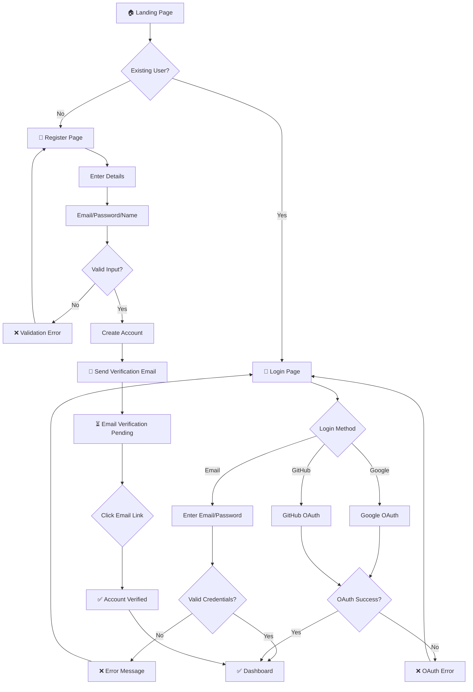
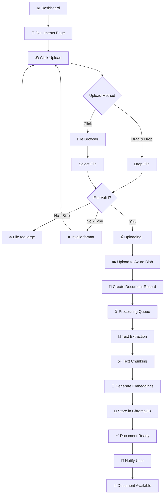
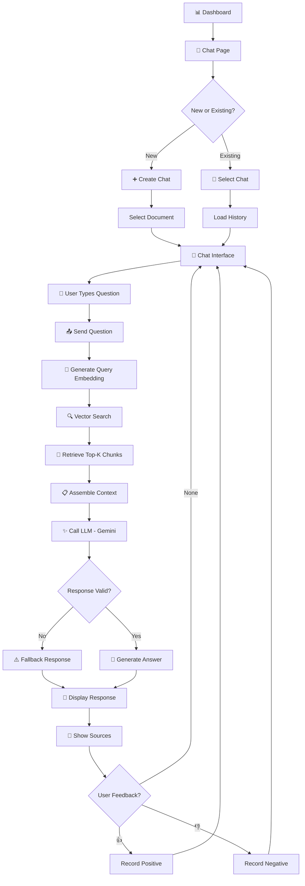
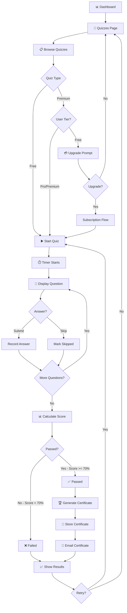
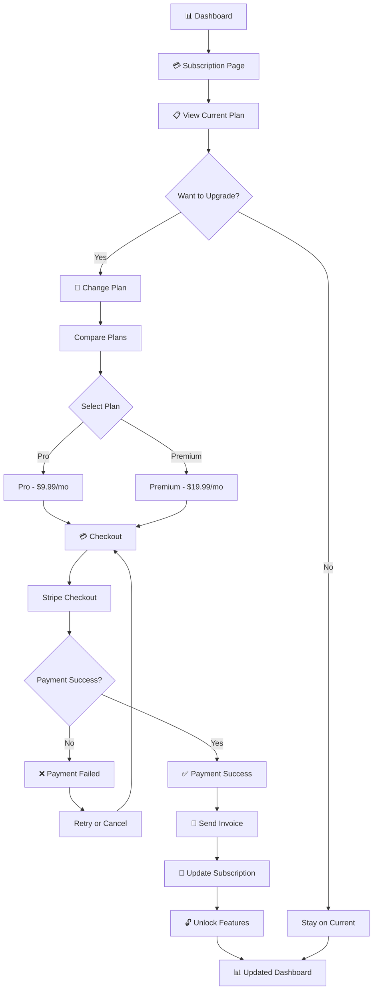

# User Flow Diagrams
## AI Smart Skill Coach

---

| Document Information | |
|---------------------|---------------------------|
| **Document ID** | UIUX-UF-AISSC-001 |
| **Version** | 1.0 |
| **Date** | December 28, 2024 |
| **Status** | Draft |
| **Author** | Senior UI/UX Designer |

---

# Table of Contents

1. [Overview](#1-overview)
2. [User Registration Flow](#2-user-registration-flow)
3. [Document Upload Flow](#3-document-upload-flow)
4. [AI Chat Flow](#4-ai-chat-flow)
5. [Quiz & Certification Flow](#5-quiz--certification-flow)
6. [Subscription Flow](#6-subscription-flow)

---

# 1. Overview

## 1.1 Purpose

Is document mein AI Smart Skill Coach ke major user flows documented hain jo user journeys ko visualize karte hain.

## 1.2 Flow Types

| Flow | Priority | Users |
|------|----------|-------|
| Registration | P0 | All |
| Document Upload | P0 | Learners |
| AI Chat | P0 | Learners |
| Quiz & Certification | P0 | Learners |
| Subscription | P1 | Learners |
| Admin Management | P2 | Admins |

---

# 2. User Registration Flow

## 2.1 Flow Diagram

## 2.2 Flow Steps

| Step | Action | Screen |
|------|--------|--------|
| 1 | User visits website | Landing Page |
| 2 | Clicks "Get Started" | Register Page |
| 3 | Enters email, password, name | Register Form |
| 4 | System validates input | - |
| 5 | Creates account | - |
| 6 | Sends verification email | - |
| 7 | User clicks email link | Email |
| 8 | Account verified | Dashboard |

---

# 3. Document Upload Flow

## 3.1 Flow Diagram

## 3.2 Flow Steps

| Step | Action | Status |
|------|--------|--------|
| 1 | User uploads file | PENDING |
| 2 | File stored in Azure | PROCESSING |
| 3 | Text extracted | PROCESSING |
| 4 | Text chunked | PROCESSING |
| 5 | Embeddings generated | PROCESSING |
| 6 | Stored in vector DB | READY |
| 7 | User notified | READY |

---

# 4. AI Chat Flow

## 4.1 Flow Diagram

## 4.2 RAG Query Steps

| Step | Component | Latency |
|------|-----------|---------|
| 1 | Query Embedding | < 50ms |
| 2 | Vector Search | < 200ms |
| 3 | Context Assembly | < 10ms |
| 4 | LLM Call | < 3s |
| 5 | Response Display | < 50ms |
| **Total** | | **< 5s** |

---

# 5. Quiz & Certification Flow

## 5.1 Flow Diagram

## 5.2 Certification Steps

| Step | Action | Output |
|------|--------|--------|
| 1 | Quiz completed | Score calculated |
| 2 | Passed (≥70%) | Certificate generated |
| 3 | PDF created | Stored in Azure |
| 4 | Email sent | User notified |
| 5 | Verification URL | Publicly verifiable |

---

# 6. Subscription Flow

## 6.1 Flow Diagram

## 6.2 Subscription Tiers

| Tier | Price | Documents | Queries/Day | Quizzes |
|------|-------|-----------|-------------|---------|
| Free | $0 | 5 | 50 | Basic |
| Pro | $9.99/mo | Unlimited | 500 | All |
| Premium | $19.99/mo | Unlimited | Unlimited | All + Priority |

---

# 7. User Flow Summary

## 7.1 Critical Paths

| Flow | Steps | Est. Time |
|------|-------|-----------|
| Registration | 8 steps | 2-3 min |
| Document Upload | 7 steps | 30 sec |
| AI Chat Query | 6 steps | < 5 sec |
| Complete Quiz | 5 steps | 20-30 min |
| Subscription | 6 steps | 2 min |

## 7.2 Error Handling

| Error | User Action | System Response |
|-------|-------------|-----------------|
| Invalid login | Re-enter credentials | Show error message |
| Upload failed | Retry upload | Show specific error |
| AI timeout | Retry query | Fallback response |
| Payment failed | Use different card | Show Stripe error |

---

*Document Version: 1.0 | Last Updated: December 28, 2024*
