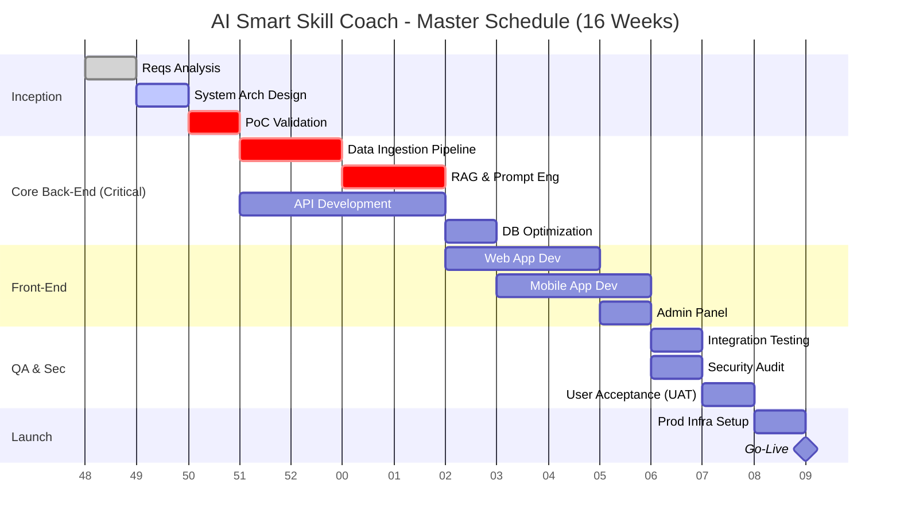

# Project Plan & Timeline
## AI Smart Skill Coach

---

| Document Information | |
|---------------------|---------------------------|
| **Document ID** | PM-PLAN-AISSC-002 |
| **Version** | 2.0 |
| **Date** | December 28, 2024 |
| **Status** | Approved |
| **Author** | Senior Program Manager |

---

# 1. Executive Summary

**Project Goal:**  
Develop and launch an enterprise-grade AI-powered e-learning platform ("AI Smart Skill Coach") that leverages RAG (Retrieval-Augmented Generation) to provide hyper-personalized learning experiences. The system will support 1,000+ concurrent users with <5s latency for AI responses.

**Strategic Justification:**  
This project addresses the market gap for "context-aware" e-learning. Unlike generic LLM wrappers, this platform integrates directly with user-specific documents, providing verifiable accuracy (citations) and structured learning paths (quizzes/certifications).

**Key Constraints:**  
- **Timeline:** 16 Weeks (Fixed Launch Window).
- **Budget:** $15,000 initial cap (Infrastructure + API).
- **Quality:** Zero hallucination tolerance for critical definitions (Guardrails required).

---

# 2. Detailed Project Phases (WBS)

## Phase 1: Inception & Architecture (Weeks 1-3)
*Focus: De-risking the technical core.*
- **1.1 Requirements Baselining:** Sign-off on SRS/AI-RS (Wk 1).
- **1.2 Architecture Definition:** Finalize Cloud, DB, and RAG design (Wk 2).
- **1.3 Proof of Concept (PoC):** Validate RAG latency on 100-page PDF (Wk 3).

## Phase 2: Core Engineering (Weeks 4-8) [CRITICAL PATH]
*Focus: Building the engine.*
- **2.1 Data Pipeline:** PDF ingestion, chunking strategy, vector embedding (Wk 4-5).
- **2.2 Prompt Engineering:** System prompts, few-shot testing, guardrail implementation (Wk 5).
- **2.3 Backend API:** Auth, User Mgmt, Document CRUD, subscription logic (Wk 6-7).
- **2.4 Database Optimization:** Indexing strategies, query optimization (Wk 8).

## Phase 3: Client Experience (Weeks 9-12)
*Focus: User interface and interaction.*
- **3.1 Web Application:** Dashboard, Chat Interface, Document Viewer (Wk 9-10).
- **3.2 Mobile Application:** Flutter dev for iOS/Android (Wk 10-11).
- **3.3 Admin Portal:** User oversight, content moderation tools (Wk 12).

## Phase 4: Quality & Hardening (Weeks 13-14)
*Focus: Stability and security.*
- **4.1 Integrated Testing:** End-to-end flows, load testing (JMeter) for 1k users (Wk 13).
- **4.2 Security Audit:** OWASP Top 10 check, Penetration testing (Wk 14).
- **4.3 UAT:** Beta group (50 users) feedback loop (Wk 14).

## Phase 5: Go-Live & Ops (Weeks 15-16)
*Focus: Launch execution.*
- **5.1 Production Env Setup:** Terraform infra provisioning (Wk 15).
- **5.2 Data Migration:** Seed initial content/templates (Wk 15).
- **5.3 Soft Launch:** Internal team only (Wk 16).
- **5.4 Public GA:** Marketing push + Feature flag toggle (Wk 16).

---

# 3. Critical Path Analysis

The **Core Engineering (AI Engine)** path is critical. Any delay in RAG pipeline accuracy or Prompt Engineering will directly delay the frontend integration and QA phases.

**Dependency Chain:**  
`RAG Logic` -> `Backend API` -> `Frontend Integration` -> `UAT`

*Mitigation:* AI Engineers to start on Day 1. Frontend team to mock API responses until Week 6.

---

# 4. Master Schedule (Gantt)

---

*Document Version: 2.0 | Status: Approved*
