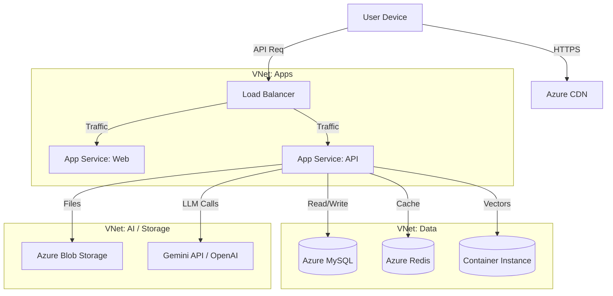

# Infrastructure Architecture
## AI Smart Skill Coach

---

| Document Information | |
|---------------------|---------------------------|
| **Document ID** | OPS-INFRA-AISSC-001 |
| **Version** | 1.0 |
| **Date** | December 28, 2024 |
| **Status** | Draft |

---

# 1. Cloud Architecture (Azure)

---

# 2. Component Specifications

## 2.1 Compute
- **Web App Service:** Standard S1 (Auto-scale: 2-5 instances)
- **API App Service:** Premium P1v2 (High CPU for processing)

## 2.2 Storage
- **Database:** Azure Database for MySQL - Flexible Server
  - Burst B2ms (2 vCores, 8GB RAM) for Start
  - General Purpose for Scale
- **Vector DB:** ChromaDB running on Azure Container Instances (ACI)
  - 4 vCPUs, 16GB Memory

## 2.3 Networking
- **VNet:** Isolated Network for Data security.
- **CDN:** Standard Verizon for static assets.
- **WAF:** Application Gateway with WAF enabled.

---

*Document Version: 1.0 | Last Updated: December 28, 2024*
