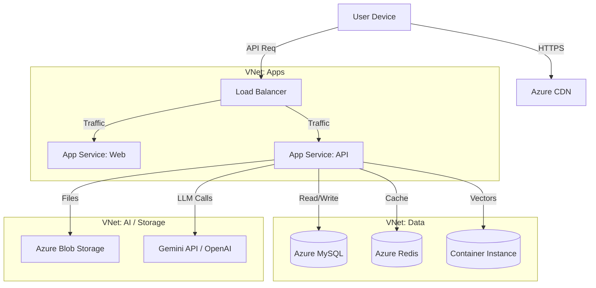

# Infrastructure Architecture
## AI Smart Skill Coach

---

| Document Information | |
|---------------------|---------------------------|
| **Document ID** | OPS-INFRA-AISSC-001 |
| **Version** | 1.0 |
| **Date** | December 28, 2024 |
| **Status** | Draft |

---

# 1. Cloud Architecture (Azure)

---

# 2. Component Specifications (Updated for Scale)

## 2.1 Compute
- **Web App Service:** Standard S1 (Auto-scale: 2-5 instances)
- **API App Service:** Premium P1v2 (High CPU for processing)
- **Background Worker:** Dedicated worker tier for bulk PDF ingestion (Organizations often upload 100+ files).

## 2.2 Data Architecture (Multi-Tenant)
- **Database Strategy:**
  - Shared Schema, Tenant ID (Column-based) for standard Orgs.
  - Dedicated Database Shard for Enterprise Clients (>5k users).
- **Vector DB:** 
  - Namespaced collections per Organization ID to prevent cross-contamination.

## 2.3 Networking & Security
- **VNet:** Isolated Network for Data security.
- **CDN:** Standard Verizon for static assets.
- **WAF:** Application Gateway with WAF enabled.
- **Rate Limiting:** Distinct policies for API (Educator vs Student).

---

*Document Version: 1.0 | Last Updated: December 28, 2024*
