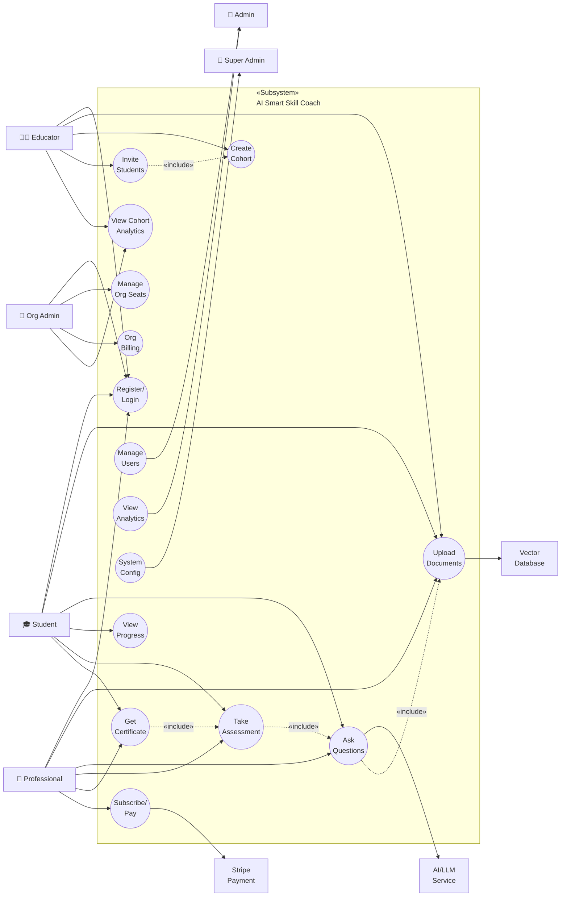

# Use Case Diagram
## AI Smart Skill Coach - v2.0 (Multi-Tenant)

---

## Actor Classification (Updated for B2B)

| Side | Actor | Type | Description |
|------|-------|------|-------------|
| **Left** | 🎓 Student | Primary B2C | Individual learners, exam aspirants |
| **Left** | 💼 Professional | Primary B2C | Self-directed upskilling users |
| **Left** | 👨‍🏫 Educator | Primary B2B | Teachers, Coaches managing classes |
| **Left** | 🏢 Org Admin | Primary B2B | School/Company administrators |
| **Right** | 👔 Admin | Secondary | Platform moderators |
| **Right** | 🔐 Super Admin | Secondary | System administrators |
| **Right** | Stripe | Supporting | Payment gateway |
| **Right** | AI/LLM | Supporting | AI model service |
| **Right** | Vector DB | Supporting | Document storage |

---

## New B2B Use Cases

| Use Case | Actor | Description |
|----------|-------|-------------|
| Create Cohort | Educator | Create a class/group for students |
| Invite Students | Educator | Share enrollment key with students |
| View Cohort Analytics | Educator, Org Admin | See progress of all students in cohort |
| Manage Org Seats | Org Admin | Add/remove users within seat limit |
| Org Billing | Org Admin | Manage enterprise subscription |

---

## Use Case Relationships

### «include» Relationships
| Base Use Case | Included Use Case | Description |
|---------------|-------------------|-------------|
| Ask Questions | Upload Documents | Must upload docs before querying |
| Take Assessment | Ask Questions | Uses AI for quiz context |
| Get Certificate | Take Assessment | Must pass quiz first |
| Invite Students | Create Cohort | Must create cohort first |

---

*Diagram Version: 2.0 | Updated for Multi-Tenant B2B/B2C Architecture*
