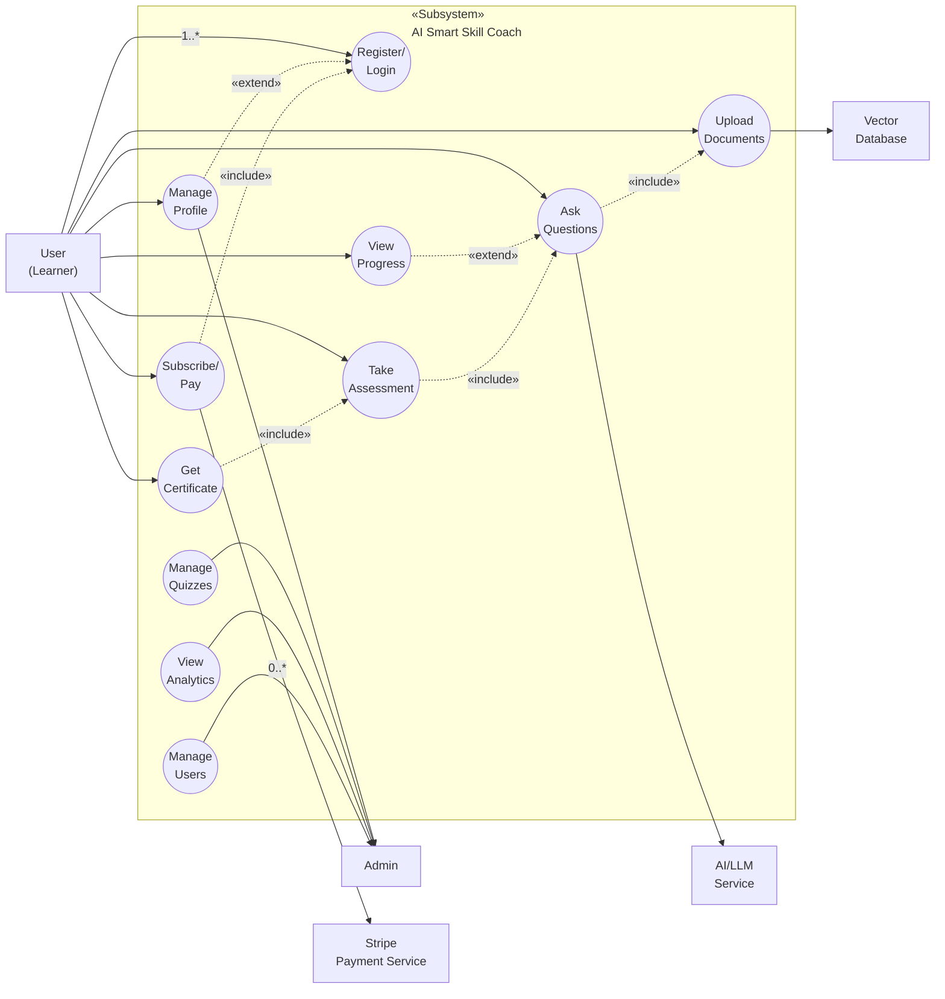

# Use Case Diagram
## AI Smart Skill Coach - v1.0

---

## Actor Classification

| Side | Actor | Type | Description |
|------|-------|------|-------------|
| **Left** | User (Learner) | Primary | Main user of the system |
| **Right** | Admin | Secondary | Platform administrator |
| **Right** | Stripe Payment | Supporting | External payment gateway |
| **Right** | AI/LLM Service | Supporting | AI model provider |
| **Right** | Vector Database | Supporting | Document storage system |

---

## Use Case Relationships

### «include» Relationships
| Base Use Case | Included Use Case | Description |
|---------------|-------------------|-------------|
| Ask Questions | Upload Documents | Must upload docs before querying |
| Take Assessment | Ask Questions | Uses AI for quiz context |
| Get Certificate | Take Assessment | Must pass quiz first |
| Subscribe/Pay | Register/Login | Must be authenticated |

### «extend» Relationships
| Base Use Case | Extending Use Case | Condition |
|---------------|-------------------|-----------|
| Ask Questions | View Progress | When tracking learning |
| Register/Login | Manage Profile | When editing profile |

---

## Multiplicity

| Actor | Use Case | Multiplicity |
|-------|----------|--------------|
| User | Register/Login | 1..* (one user, many sessions) |
| User | Subscribe/Pay | 0..* (optional, multiple payments) |
| Stripe | Subscribe/Pay | 1 (single gateway) |
