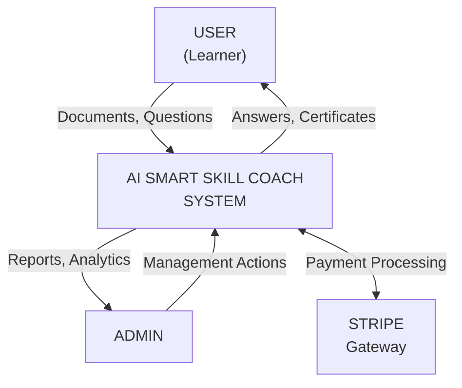

# DFD Level 0 - Context Diagram
## AI Smart Skill Coach - v1.0

---

## External Entities

| Entity | Type | Data Flow In | Data Flow Out |
|--------|------|--------------|---------------|
| User | Primary Actor | Documents, Questions, Credentials | Answers, Certificates, Progress |
| Admin | Secondary Actor | Management Commands | Reports, Analytics |
| Stripe | External System | Payment Confirmation | Payment Requests |
