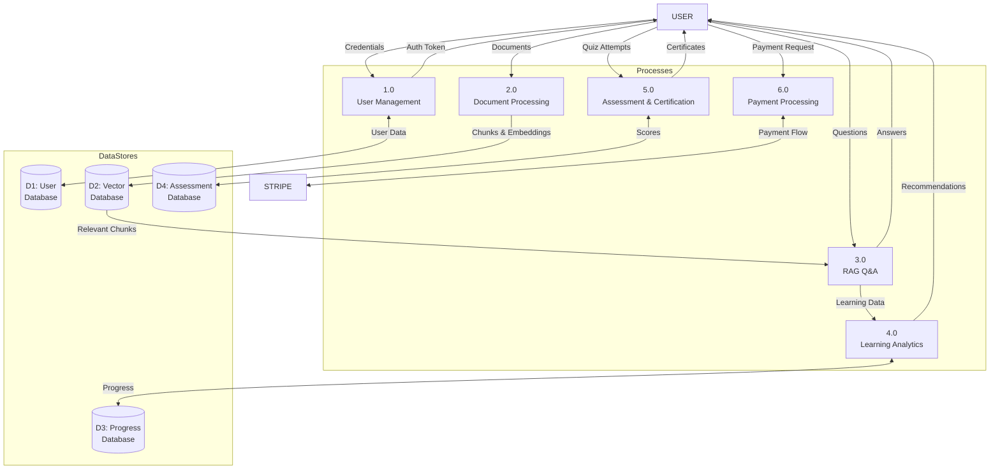

# DFD Level 1 - Detailed Data Flow
## AI Smart Skill Coach - v1.0

---

## Process Descriptions

| Process | Description |
|---------|-------------|
| 1.0 User Management | Authentication, registration, profile |
| 2.0 Document Processing | Upload, extract, chunk, embed |
| 3.0 RAG Q&A | Retrieve context, generate answers |
| 4.0 Learning Analytics | Track progress, detect weak areas |
| 5.0 Assessment & Certification | Quizzes, scoring, certificates |
| 6.0 Payment Processing | Stripe integration, subscriptions |
