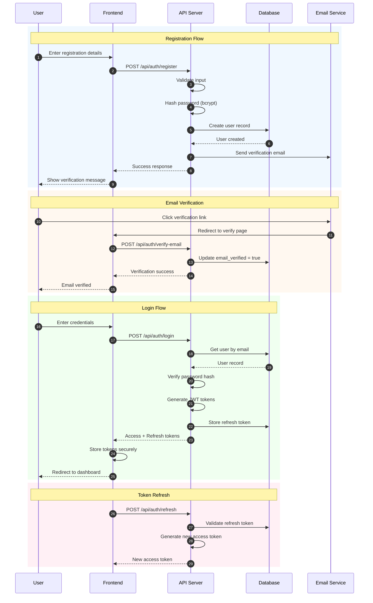

# Sequence Diagram - Authentication Flow
## AI Smart Skill Coach - v1.0

---

## Authentication Security

| Security Measure | Implementation |
|------------------|----------------|
| Password Storage | bcrypt with cost factor 12 |
| Token Type | JWT (RS256) |
| Access Token TTL | 15 minutes |
| Refresh Token TTL | 7 days |
| Email Verification | Required before full access |
