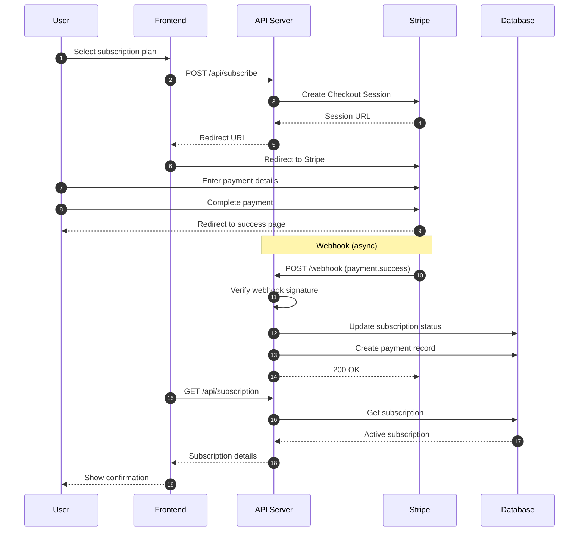

# Sequence Diagram - Payment Flow
## AI Smart Skill Coach - v1.0

---

## Payment Security

| Security Measure | Implementation |
|------------------|----------------|
| Card Data | Handled by Stripe (PCI DSS) |
| Webhook Verification | Stripe signature validation |
| Subscription Status | Webhook-based activation only |
