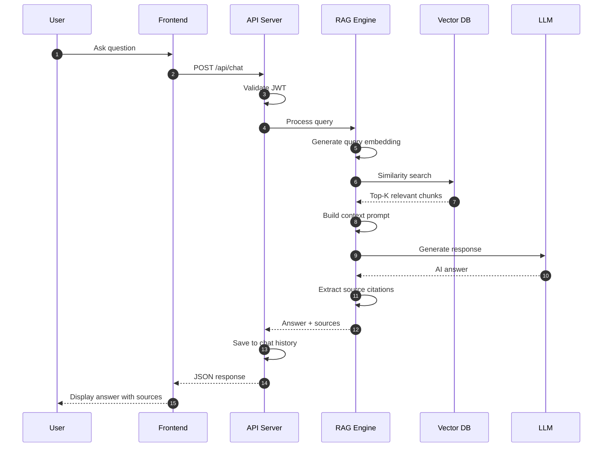

# Sequence Diagram - Q&A Flow
## AI Smart Skill Coach - v1.0

---

## Flow Details

| Step | Component | Action |
|------|-----------|--------|
| 1-3 | Frontend → API | User submits question |
| 4-5 | RAG Engine | Convert question to embedding |
| 6-7 | Vector DB | Find similar document chunks |
| 8-10 | LLM | Generate answer from context |
| 11-14 | Response | Return answer with citations |
