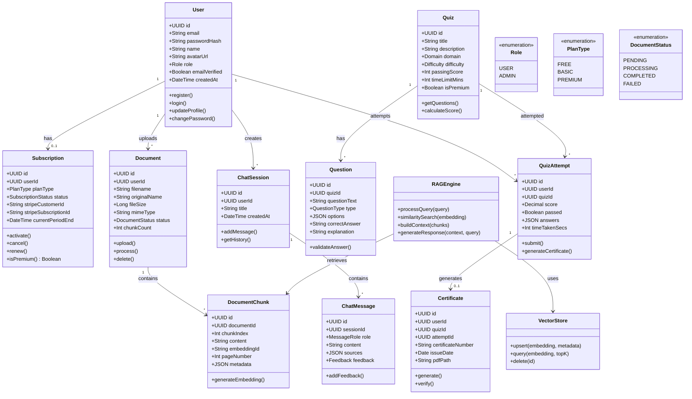

# Class Diagram
## AI Smart Skill Coach - v1.0

---

## Domain Summary

| Domain | Classes | Description |
|--------|---------|-------------|
| User | User, Subscription | User management & subscriptions |
| Document | Document, DocumentChunk | Document upload & processing |
| Chat | ChatSession, ChatMessage | AI chat functionality |
| Quiz | Quiz, Question, QuizAttempt, Certificate | Assessment system |
| AI/RAG | RAGEngine, VectorStore | AI infrastructure |
