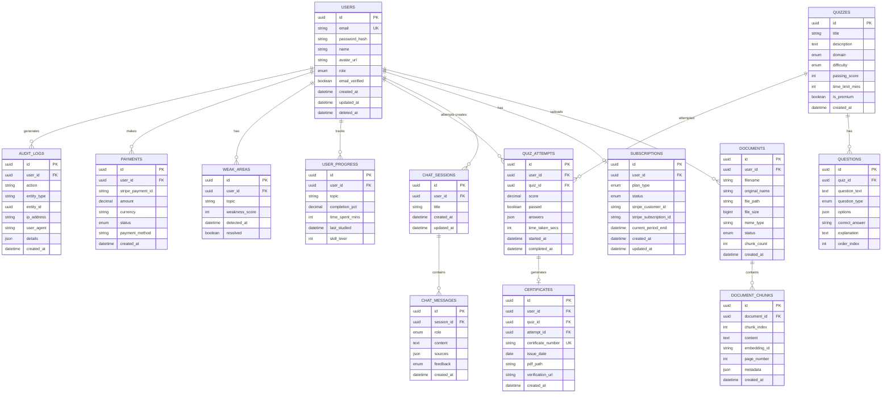

# Entity Relationship Diagram (ERD)
## AI Smart Skill Coach - v1.0

---

## Key Constraints

| Table | Primary Key | Foreign Keys | Unique |
|-------|-------------|--------------|--------|
| users | id | - | email |
| documents | id | user_id | - |
| certificates | id | user_id, quiz_id, attempt_id | certificate_number |
| subscriptions | id | user_id | - |
