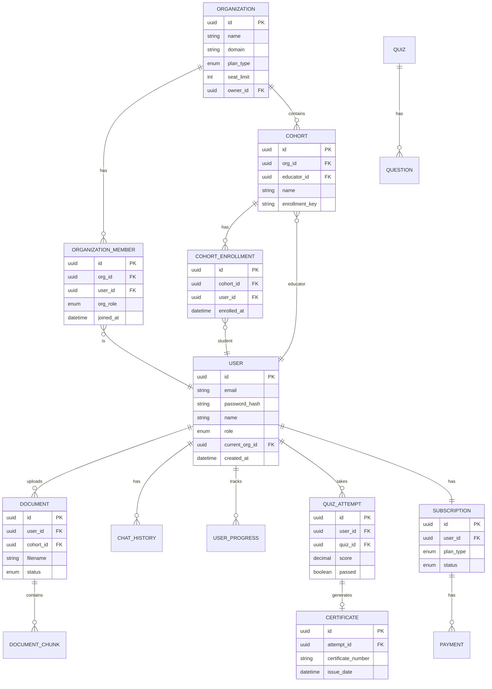

# Entity Relationship Overview
## AI Smart Skill Coach - v2.0 (Multi-Tenant)

## Relationship Summary (Updated for B2B)

| Entity | Relationship | Related Entity | Description |
|--------|--------------|----------------|-------------|
| **ORGANIZATION** | 1:N | ORGANIZATION_MEMBER | Org has many members |
| **ORGANIZATION** | 1:N | COHORT | Org has many cohorts |
| **COHORT** | 1:N | COHORT_ENROLLMENT | Cohort has many enrolled students |
| USER | 1:N | DOCUMENT | User uploads documents |
| USER | 1:1 | SUBSCRIPTION | User has one subscription |
| QUIZ_ATTEMPT | 1:0..1 | CERTIFICATE | Generates cert if passed |

---

*Diagram Version: 2.0 | Updated for Multi-Tenant Architecture*
