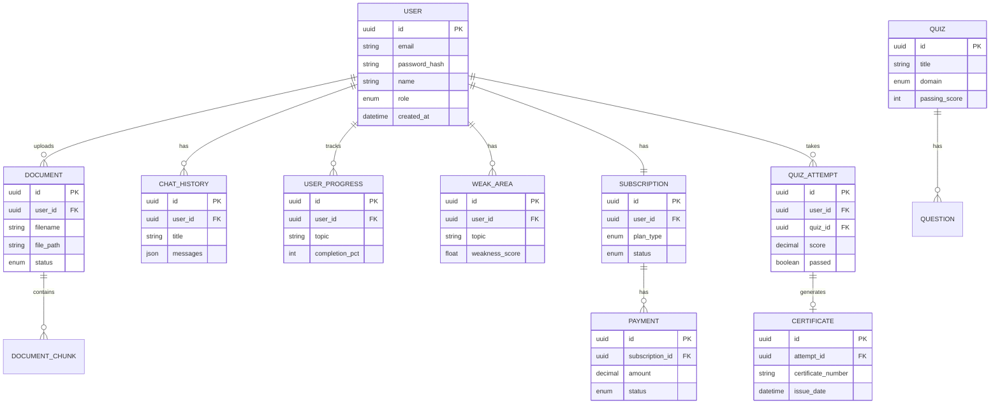

# Entity Relationship Overview
## AI Smart Skill Coach - v1.0

## Relationship Summary

| Entity | Relationship | Related Entity |
|--------|--------------|----------------|
| USER | 1:N | DOCUMENT, CHAT_HISTORY, USER_PROGRESS, WEAK_AREA, QUIZ_ATTEMPT |
| USER | 1:1 | SUBSCRIPTION |
| DOCUMENT | 1:N | DOCUMENT_CHUNK |
| QUIZ | 1:N | QUESTION |
| QUIZ_ATTEMPT | 1:0..1 | CERTIFICATE (if passed) |
| SUBSCRIPTION | 1:N | PAYMENT |
