# Document Upload Activity Diagram
## AI Smart Skill Coach - v1.0

```mermaid
flowchart TD
    Start((●)) --> A[Select Document]
    A --> B{Validate File<br/>Size & Type}
    
    B -->|Valid| C[Upload to Storage]
    B -->|Invalid| D[Show Error Message]
    D --> End1((◉))
    
    C --> E[Extract Text<br/>from PDF]
    E --> F[Split into Chunks<br/>500-1000 tokens]
    F --> G[Generate Embeddings<br/>sentence-transformers]
    G --> H[Store in Vector DB]
    H --> I[Update Document Status<br/>Ready]
    I --> End2((◉))

    style Start fill:#000
    style End1 fill:#000
    style End2 fill:#000
    style B fill:#ffd700
    style D fill:#ff6b6b
    style I fill:#51cf66
```

## Process Steps

| Step | Action | Details |
|------|--------|---------|
| 1 | Select Document | User selects PDF/DOCX/TXT file |
| 2 | Validate File | Size ≤ 10MB, Valid type, Virus scan |
| 3 | Upload to Storage | Store in Azure Blob Storage |
| 4 | Extract Text | Parse PDF/DOCX content |
| 5 | Split into Chunks | 500-1000 tokens per chunk |
| 6 | Generate Embeddings | sentence-transformers model |
| 7 | Store in Vector DB | ChromaDB/Pinecone storage |
| 8 | Update Status | Mark document as "Ready" |

## Validation Rules

| Rule | Limit |
|------|-------|
| Max File Size | 10 MB |
| Allowed Types | PDF, DOCX, TXT |
| Chunk Size | 500-1000 tokens |
| Overlap | 100 tokens |
