# Quiz & Certification Activity Diagram
## AI Smart Skill Coach - v1.0

```mermaid
flowchart TD
    Start((●)) --> A[Browse Quizzes]
    A --> B[Select Quiz]
    B --> C{Check Premium<br/>Status}
    
    C -->|Has Access| D[Start Quiz Attempt]
    C -->|Needs Payment| E[Redirect to Payment]
    E --> F{Payment<br/>Successful?}
    F -->|Yes| D
    F -->|No| End1((◉))
    
    D --> G[Answer Question]
    G --> H{More<br/>Questions?}
    H -->|Yes| G
    H -->|No| I[Submit Quiz]
    
    I --> J[Calculate Score]
    J --> K{Score >= 80%?}
    
    K -->|Yes| L[Generate Certificate]
    K -->|No| M[Show Results<br/>No Certificate]
    
    L --> N[Send Email Notification]
    N --> O[View Results]
    M --> O
    O --> End2((◉))

    style Start fill:#000
    style End1 fill:#000
    style End2 fill:#000
    style C fill:#ffd700
    style K fill:#ffd700
    style L fill:#51cf66
    style M fill:#ff6b6b

    subgraph User["👤 USER ACTIONS"]
        A
        B
        G
        O
    end

    subgraph System["⚙️ SYSTEM ACTIONS"]
        C
        J
        L
        N
    end
```

## Flow Details

| Phase | Action | Actor | Condition |
|-------|--------|-------|-----------|
| Browse | View quiz list | User | - |
| Select | Choose quiz | User | - |
| Access Check | Verify subscription | System | Premium quizzes need paid plan |
| Quiz | Answer questions | User | Time limit applies |
| Submit | Send answers | User | All questions answered |
| Score | Calculate result | System | Compare with correct answers |
| Certificate | Generate PDF | System | Score >= 80% |
| Notify | Send email | System | Certificate generated |

## Certification Rules

| Rule | Value |
|------|-------|
| Passing Score | 80% |
| Certificate Format | PDF |
| Verification | Unique URL |
| Validity | Lifetime |
