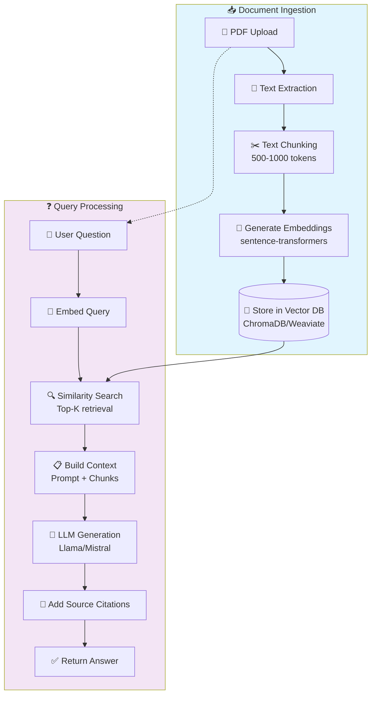

# RAG Pipeline Flowchart
## AI Smart Skill Coach - v1.0

---

## Pipeline Metrics

| Stage | Target |
|-------|--------|
| Text Extraction | 95%+ accuracy |
| Chunking | 500-1000 tokens |
| Embedding | 384/768 dimensions |
| Retrieval | Top 5-10 chunks |
| Response Time | < 5 seconds |
