# Subscription State Diagram
## AI Smart Skill Coach - v1.0

```mermaid
stateDiagram-v2
    [*] --> Registered: User signs up
    
    Registered --> PaymentPending: subscribe()
    PaymentPending --> Active: payment_success()
    PaymentPending --> Registered: payment_failed()
    
    Active --> Active: renew()
    Active --> Cancelled: cancel()
    Active --> Expired: period_end()
    
    Cancelled --> Registered: period_end()
    Expired --> Registered: --
    Expired --> PaymentPending: resubscribe()
    
    Registered --> [*]: delete_account()
    
    note right of Registered
        Free tier access
        Limited features
    end note
    
    note right of Active
        Full access
        Premium features
    end note
    
    note right of Cancelled
        Access until period end
        No auto-renewal
    end note
```

---

## State Transitions

| From | To | Trigger |
|------|----|----|
| Registered | PaymentPending | User initiates subscription |
| PaymentPending | Active | Stripe payment success |
| Active | Cancelled | User cancels |
| Active | Expired | Subscription period ends |
| Expired | PaymentPending | User resubscribes |
