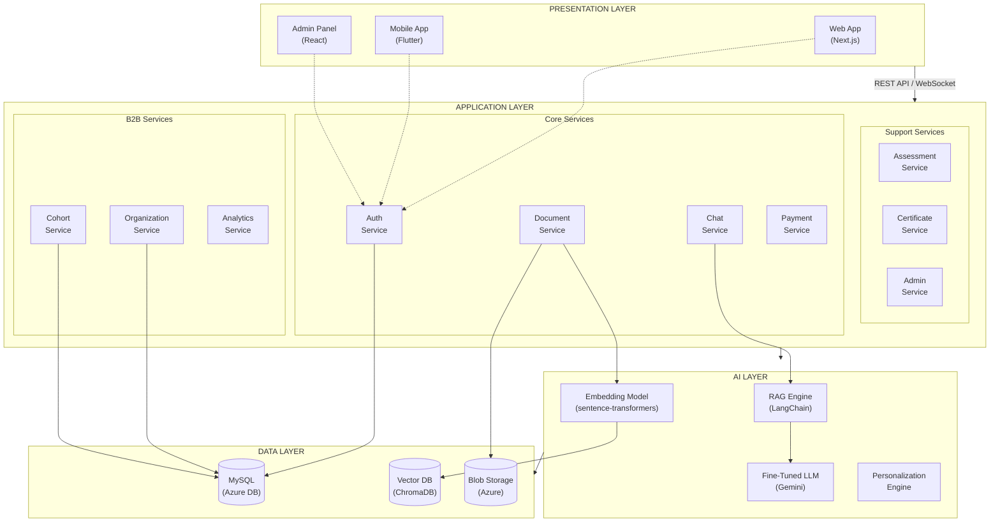

# Component Diagram
## AI Smart Skill Coach - v2.0 (Multi-Tenant)

## Layer Description (Updated for B2B)

| Layer | Components | Technology |
|-------|------------|------------|
| Presentation | Web App, Mobile App, **Admin Panel** | Next.js, Flutter, React |
| Application | Auth, Document, Chat, Payment, **Org, Cohort**, Assessment, Cert, Analytics, Admin | Python FastAPI |
| AI | RAG Engine, LLM, Embeddings, Personalization | LangChain, Gemini |
| Data | MySQL, Vector DB, Blob Storage | Azure DB, ChromaDB, Azure Storage |

## New B2B Services

| Service | Responsibility | Dependencies |
|---------|----------------|--------------|
| **Organization Service** | Org CRUD, Seat Management, Billing | MySQL, Payment Service |
| **Cohort Service** | Class/Group Management, Enrollment | MySQL, Analytics |
| **Analytics Service** | Org-wide and Cohort-level reports | MySQL, All Services |

---

*Diagram Version: 2.0 | Updated for Multi-Tenant Architecture*
