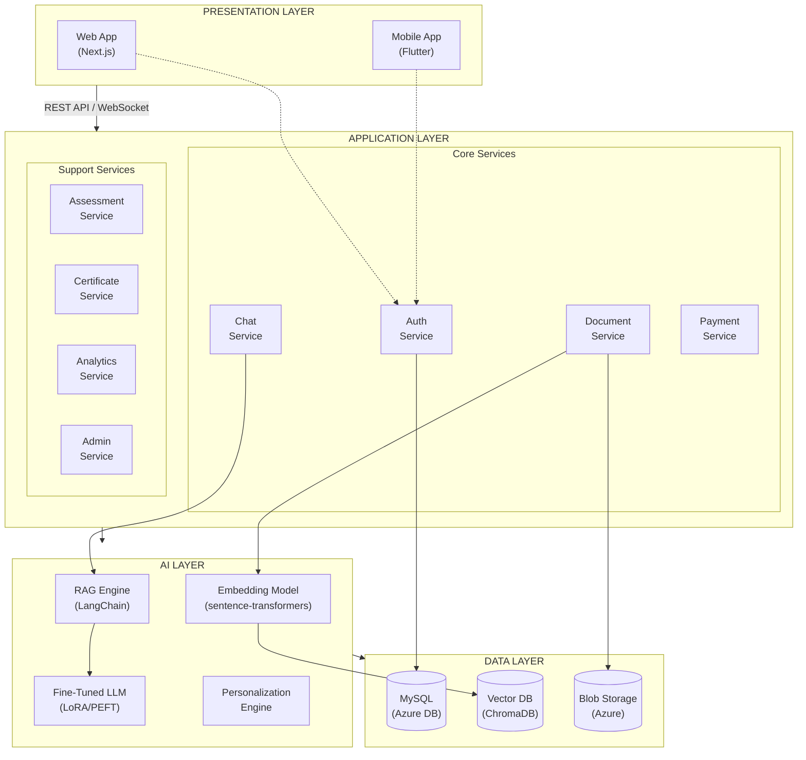

# Component Diagram
## AI Smart Skill Coach - v1.0

## Layer Description

| Layer | Components | Technology |
|-------|------------|------------|
| Presentation | Web App, Mobile App | Next.js, Flutter |
| Application | Auth, Document, Chat, Payment, Assessment, Cert, Analytics, Admin | Python FastAPI |
| AI | RAG Engine, LLM, Embeddings, Personalization | LangChain, LoRA/PEFT |
| Data | MySQL, Vector DB, Blob Storage | Azure DB, ChromaDB, Azure Storage |
