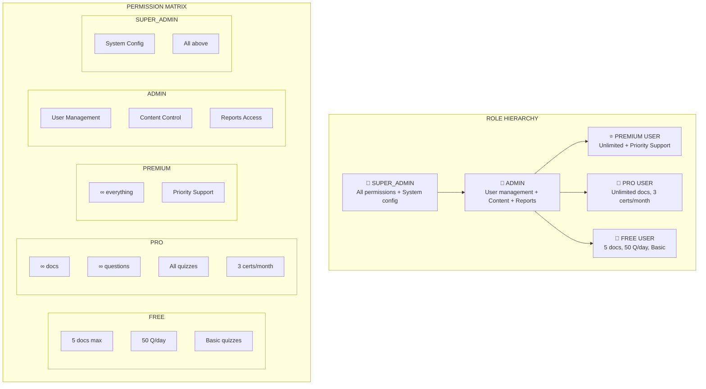

# RBAC (Role-Based Access Control) Diagram
## AI Smart Skill Coach - v1.0



## Permission Details

| Permission | FREE | PRO | PREMIUM | ADMIN | SUPER_ADMIN |
|------------|------|-----|---------|-------|-------------|
| Upload Documents | 5 max | ∞ | ∞ | ∞ | ∞ |
| AI Questions | 50/day | ∞ | ∞ | ∞ | ∞ |
| Quizzes | Basic | All | All | All | All |
| Certificates | ✗ | 3/month | ∞ | ∞ | ∞ |
| Priority Support | ✗ | ✗ | ✓ | ✓ | ✓ |
| User Management | ✗ | ✗ | ✗ | ✓ | ✓ |
| System Config | ✗ | ✗ | ✗ | ✗ | ✓ |

## Role Inheritance

```
SUPER_ADMIN
    └── ADMIN
        ├── PREMIUM USER
        ├── PRO USER
        └── FREE USER
```
