# RBAC (Role-Based Access Control) Diagram
## AI Smart Skill Coach - v2.0 (Multi-Tenant)

```mermaid
flowchart TB
    subgraph Hierarchy["ROLE HIERARCHY"]
        SA["🔐 SUPER_ADMIN<br/>System Config + All"]
        A["👔 ADMIN<br/>Platform Moderation"]
        OA["🏢 ORG_ADMIN<br/>Org Seats, Billing, Analytics"]
        E["👨‍🏫 EDUCATOR<br/>Cohorts, Student Progress"]
        P["💼 PROFESSIONAL<br/>Unlimited + Certs"]
        S["🎓 STUDENT<br/>Basic Learning"]
    end

    SA --> A
    A --> OA
    OA --> E
    E --> S
    A --> P
    P --> S

    subgraph B2C["B2C PERMISSIONS"]
        direction LR
        subgraph Student["🎓 STUDENT"]
            S1["Upload 5 docs"]
            S2["50 Q/day"]
            S3["Basic quizzes"]
        end
        subgraph Prof["💼 PROFESSIONAL"]
            P1["∞ docs"]
            P2["∞ questions"]
            P3["All quizzes + Certs"]
        end
    end

    subgraph B2B["B2B PERMISSIONS"]
        direction LR
        subgraph Edu["👨‍🏫 EDUCATOR"]
            E1["Create Cohorts"]
            E2["Assign Content"]
            E3["View Student Progress"]
        end
        subgraph Org["🏢 ORG_ADMIN"]
            O1["Manage Seats"]
            O2["Org Billing"]
            O3["Org Analytics"]
        end
    end

    subgraph System["SYSTEM PERMISSIONS"]
        direction LR
        subgraph Admin["👔 ADMIN"]
            A1["User Moderation"]
            A2["Content Control"]
        end
        subgraph Super["🔐 SUPER_ADMIN"]
            SA1["System Config"]
            SA2["All Permissions"]
        end
    end
```



---

## Permission Matrix (Updated for B2B)

| Permission | Student | Professional | Educator | Org Admin | Admin | Super Admin |
|------------|---------|--------------|----------|-----------|-------|-------------|
| Upload Documents | 5 max | ∞ | ∞ | ❌ | ∞ | ∞ |
| AI Questions | 50/day | ∞ | ∞ | ❌ | ∞ | ∞ |
| Take Quizzes | Basic | All | All | ❌ | All | All |
| Get Certificates | ❌ | ✅ | ✅ | ❌ | ✅ | ✅ |
| **Create Cohorts** | ❌ | ❌ | ✅ | ❌ | ✅ | ✅ |
| **View Cohort Progress** | ❌ | ❌ | ✅ | ✅ | ✅ | ✅ |
| **Manage Org Seats** | ❌ | ❌ | ❌ | ✅ | ✅ | ✅ |
| **Org Billing** | ❌ | ❌ | ❌ | ✅ | ❌ | ✅ |
| User Moderation | ❌ | ❌ | ❌ | ❌ | ✅ | ✅ |
| System Config | ❌ | ❌ | ❌ | ❌ | ❌ | ✅ |

---

## Role Inheritance (Updated)

```
SUPER_ADMIN
├── ADMIN
│   ├── ORG_ADMIN
│   │   └── EDUCATOR
│   │       └── STUDENT
│   └── PROFESSIONAL
│       └── STUDENT
```

---

## Org-Level vs System-Level Roles

| Scope | Roles | Description |
|-------|-------|-------------|
| **Global** | SUPER_ADMIN, ADMIN | Platform-wide permissions |
| **Org-Scoped** | ORG_ADMIN, EDUCATOR | Limited to their organization |
| **Individual** | STUDENT, PROFESSIONAL | Personal account only |

---

*Diagram Version: 2.0 | Updated for Multi-Tenant B2B/B2C Architecture*
