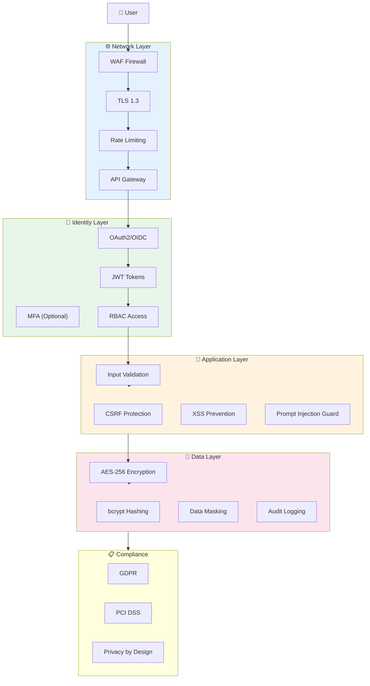

# Security Architecture Diagram
## AI Smart Skill Coach - v1.0

---

## Security Controls

| Layer | Controls |
|-------|----------|
| Identity | OAuth2, JWT, MFA, RBAC |
| Network | WAF, TLS 1.3, Rate Limiting |
| Application | Input Validation, CSRF, XSS, Prompt Guard |
| Data | AES-256, bcrypt, Masking, Audit Logs |
| Compliance | GDPR, PCI DSS |
