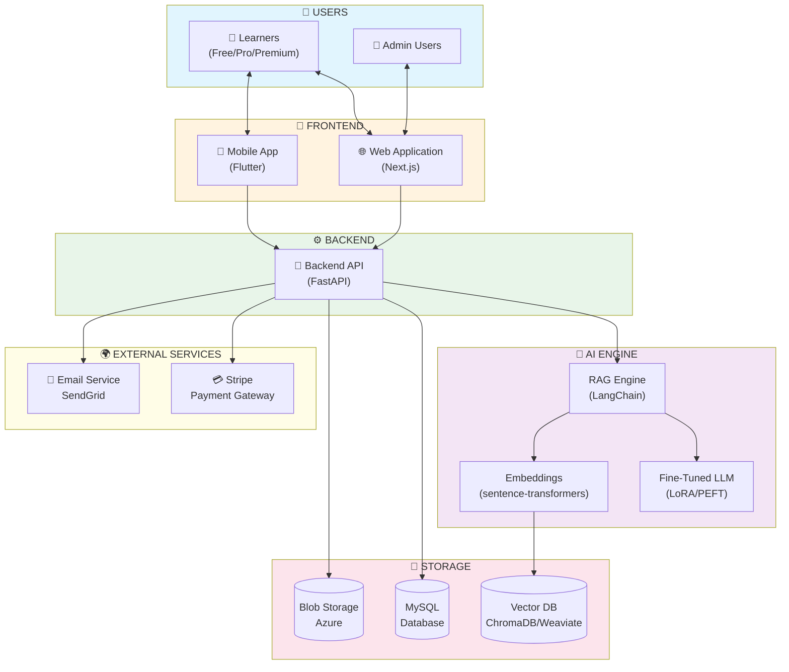

# System Context Diagram
## AI Smart Skill Coach - Product Perspective

## Component Description

| Component | Technology | Purpose |
|-----------|------------|---------|
| Web App | Next.js | User-facing web interface |
| Mobile App | Flutter | Cross-platform mobile app |
| Backend API | FastAPI | REST API & business logic |
| AI Engine | LangChain + LLM | RAG & Q&A processing |
| MySQL | Azure Database | Relational data storage |
| Vector DB | ChromaDB | Embeddings storage & search |
| Stripe | Payment API | Subscription management |
