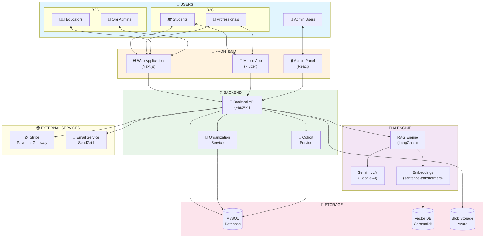

# System Context Diagram
## AI Smart Skill Coach - v2.0 (Multi-Tenant)

## Component Description (Updated for B2B)

| Component | Technology | Purpose |
|-----------|------------|---------|
| Web App | Next.js | User-facing web interface |
| Mobile App | Flutter | Cross-platform mobile app |
| **Admin Panel** | React | Org Admin & Super Admin console |
| Backend API | FastAPI | REST API & business logic |
| **Organization Svc** | FastAPI | Org CRUD, Seat Management |
| **Cohort Svc** | FastAPI | Class/Group Management |
| AI Engine | LangChain + Gemini | RAG & Q&A processing |
| MySQL | Azure Database | Relational data + Multi-tenant |
| Vector DB | ChromaDB | Embeddings (Namespaced per Org) |
| Stripe | Payment API | B2C Subscription + B2B Billing |

---

*Diagram Version: 2.0 | Updated for Multi-Tenant Architecture*
