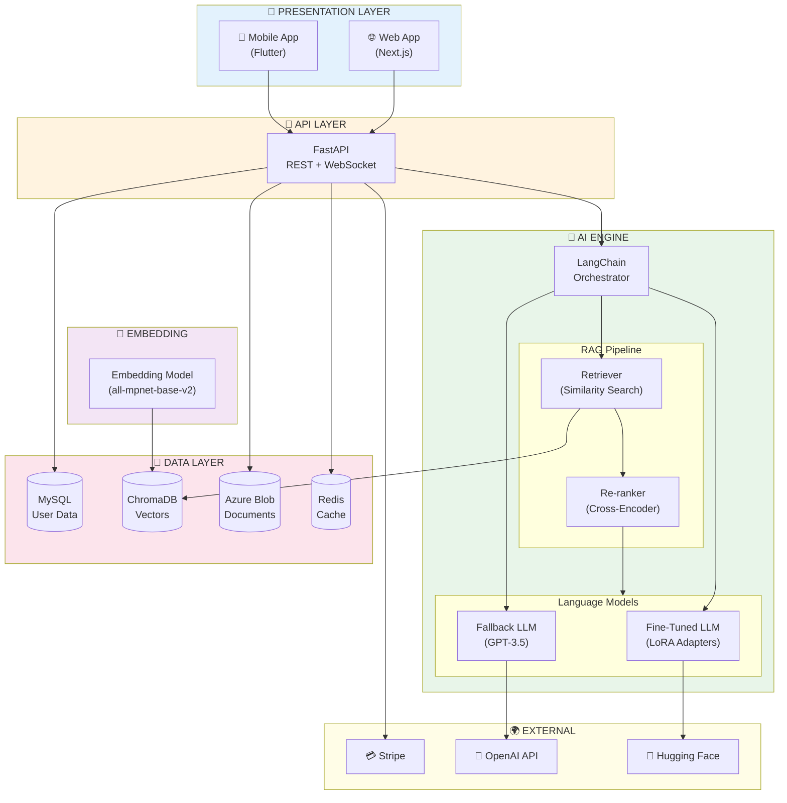

# AI System Architecture
## AI Smart Skill Coach - v1.0



## Layer Responsibilities

| Layer | Components | Technology | Purpose |
|-------|------------|------------|---------|
| Presentation | Web, Mobile | Next.js, Flutter | User interface |
| API | REST, WebSocket | FastAPI | Request handling |
| AI Engine | RAG, LLM | LangChain | Intelligence |
| Embedding | Model | sentence-transformers | Vector generation |
| Storage | DB, Vector, Blob | MySQL, ChromaDB, Azure | Data persistence |
| External | Payment, AI | Stripe, OpenAI | Third-party services |

## Data Flow

```
User Query → API → LangChain → Retriever → Vector Search
                                    ↓
              Response ← LLM ← Re-ranker ← Top-K Chunks
```

## Scaling Strategy

| Component | Scaling Method |
|-----------|----------------|
| API | Horizontal (K8s pods) |
| LLM | GPU instances + load balancer |
| Vector DB | Sharding by user_id |
| Cache | Redis cluster |
