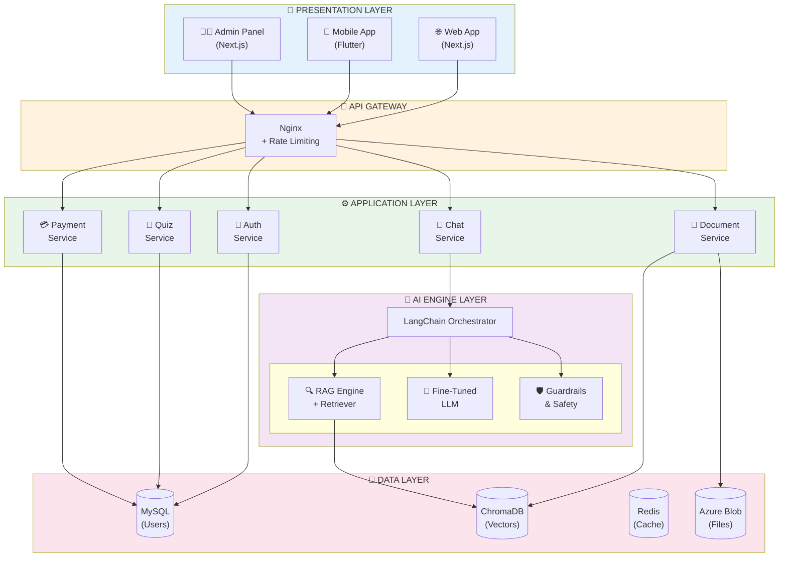

# Architecture Layers Diagram
## AI Smart Skill Coach - v1.0

## Layer Description

| Layer | Components | Technology |
|-------|------------|------------|
| Presentation | Web App, Mobile App, Admin Panel | Next.js, Flutter |
| API Gateway | Nginx, Rate Limiter | Nginx |
| Application | Auth, Document, Chat, Quiz, Payment | Python FastAPI |
| AI Engine | LangChain, RAG, Fine-Tuned LLM, Guardrails | LangChain, Gemini, Mistral |
| Data | MySQL, ChromaDB, Redis, Azure Blob | MySQL, ChromaDB, Redis |

## Component Communication

| From | To | Protocol |
|------|----|----------|
| Frontend | API Gateway | HTTPS |
| API Gateway | Services | HTTP/REST |
| Services | Databases | TCP |
| Chat Service | AI Engine | Async |
| AI Engine | LLM API | HTTPS |
