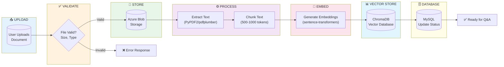

# Document Ingestion Pipeline
## AI Smart Skill Coach - v1.0

## Pipeline Stages

| Stage | Technology | Input | Output |
|-------|------------|-------|--------|
| Upload | FastAPI | File (PDF/DOCX/TXT) | Blob URL |
| Validate | Pydantic | File metadata | Validation result |
| Store | Azure Blob | File bytes | Storage path |
| Extract | PyPDF2/pdfplumber | PDF file | Raw text |
| Chunk | LangChain | Raw text | Text chunks (500-1000 tokens) |
| Embed | sentence-transformers | Text chunks | Vectors (768 dims) |
| Store Vectors | ChromaDB | Embeddings | Vector IDs |
| Update DB | SQLAlchemy | Doc metadata | Status: "Ready" |

## Error Handling

| Error | Cause | Action |
|-------|-------|--------|
| Invalid Type | Unsupported format | Return 400 |
| Size Exceeded | > 10MB | Return 413 |
| Extraction Failed | Corrupted file | Retry OCR |
| Embedding Failed | Model error | Queue retry |
